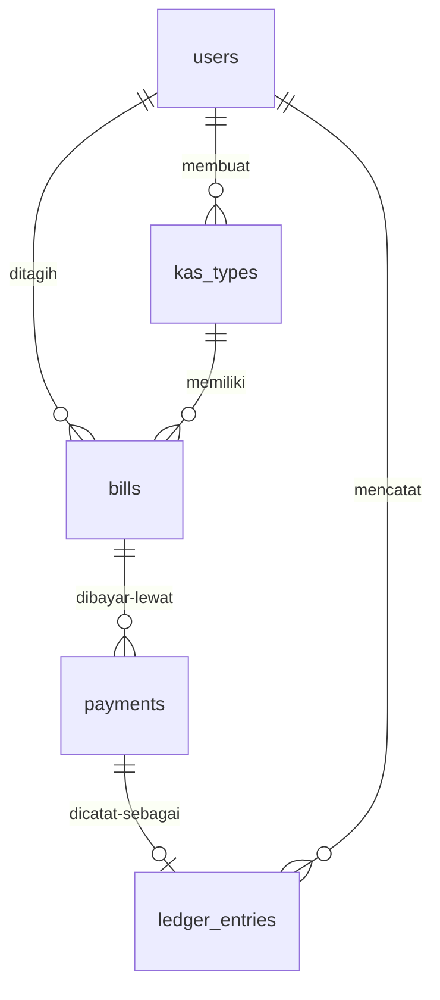
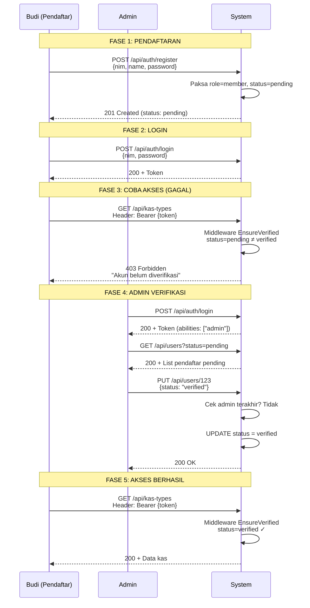
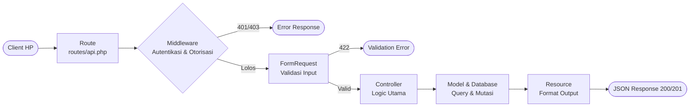
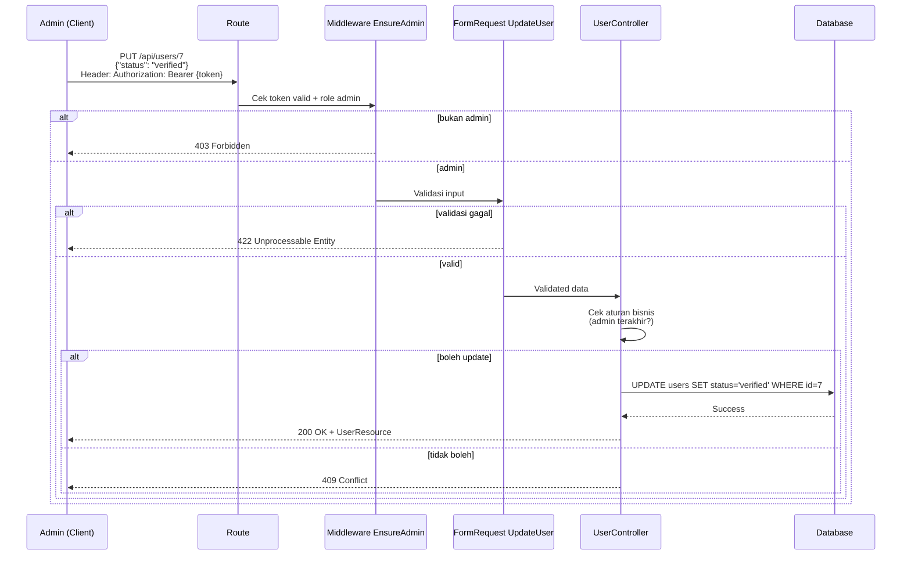
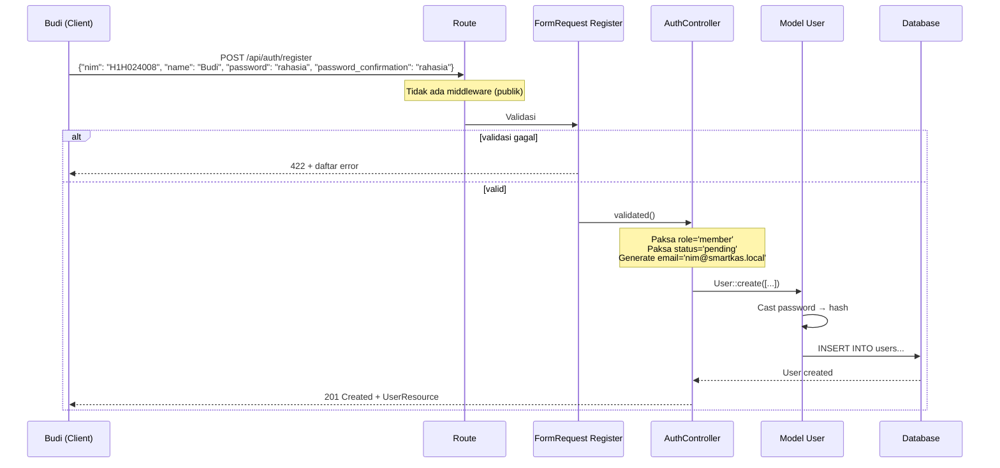

# Penjelasan Tahap 1 Smart-Kas — Panduan Teknis untuk Pemula

> Dokumentasi lengkap Tahap 1: setup autentikasi, struktur database, dan sistem manajemen anggota. 
> Semua istilah teknis dijelaskan dengan analogi ringkas, lalu langsung ke implementasi.

---

## Daftar Isi

- [Bab 0: Peta Perjalanan](#bab-0-peta-perjalanan)
- [Bab 1: Setup Sanctum (Autentikasi Token)](#bab-1-setup-sanctum-autentikasi-token)
- [Bab 2: Migration - Struktur Database](#bab-2-migration-struktur-database)
- [Bab 3: Aturan Foreign Key](#bab-3-aturan-foreign-key)
- [Bab 4: Migration Empat Tabel Baru](#bab-4-migration-empat-tabel-baru)
- [Bab 5: Model & Relasi Eloquent](#bab-5-model-relasi-eloquent)
- [Bab 6: Query Builder](#bab-6-query-builder)
- [Bab 7: Alur Request (Route → Middleware → Controller)](#bab-7-alur-request)
- [Bab 8: FormRequest, Middleware, Controller](#bab-8-formrequest-middleware-controller)
- [Bab 9: Seeder & Factory](#bab-9-seeder-factory)
- [Bab 10: Testing](#bab-10-testing)
- [Bab 11: Bug Fix - Route Model Binding](#bab-11-bug-fix)

---

## Bab 0: Peta Perjalanan

```
PAGI                    SIANG                    SORE                    MALAM
 │                       │                        │                        │
 ▼                       ▼                        ▼                        ▼
Setup Sanctum        Migration 5 tabel       Model 5 tabel          Controller + Middleware
(Bab 1)              (Bab 2-4)               (Bab 5)                (Bab 6-8)
                                                                              │
                                                              Seeder + Testing (Bab 9-11)
```

**Hasil Akhir:**
- Anggota bisa daftar → Admin menyetujui → Login pakai token → 7 tes hijau di `SmartKasFondasiTest`
- Fondasi selesai. Fitur kas (bayar QRIS, buku kas) Tahap 2.

---

## Bab 1: Setup Sanctum (Autentikasi Token)

### Konsep Dasar

**API (Application Programming Interface)** = Sistem komunikasi tanpa browser. HP mengirim JSON ke server, bukan HTML.

**Token** = String acak panjang sebagai bukti login. Analogi: **gelang konser** — beli tiket (login) → dapat gelang (token) → tunjukin tiap masuk → gunting saat pulang (logout).

**Laravel Sanctum** = Paket resmi untuk mengelola token API.

### Instalasi

```bash
composer require laravel/sanctum
```

Baris di atas untuk → Mengunduh paket Sanctum ke project

```bash
php artisan install:api
```

Baris di atas untuk → Menjalankan installer API yang otomatis:
- Membuat `routes/api.php`
- Membuat migration `personal_access_tokens`
- Memberi instruksi menambah `HasApiTokens` ke model User

### Struktur Tabel personal_access_tokens

```php
Schema::create('personal_access_tokens', function (Blueprint $table) {
    $table->id();
    $table->morphs('tokenable');    // tokenable_type + tokenable_id
    $table->text('name');            // nama token, misal "api"
    $table->string('token', 64)->unique();  // token hash
    $table->text('abilities')->nullable();  // izin: ["admin"] atau ["member"]
    $table->timestamp('last_used_at')->nullable();
    $table->timestamp('expires_at')->nullable()->index();
    $table->timestamps();
});
```

**Penjelasan per kolom:**

- `$table->id()` → Primary key auto-increment
- `$table->morphs('tokenable')` → Relasi polimorfik (fleksibel, bisa milik User atau model lain)
  - `tokenable_type` → Nama class pemilik (contoh: `App\Models\User`)
  - `tokenable_id` → ID pemilik (contoh: `7`)
- `$table->text('name')` → Label token untuk identifikasi. `text` bukan `string` — panjang nama token tidak dibatasi 255 karakter.
- `$table->string('token', 64)->unique()` → Token yang sudah di-hash, unik
- `$table->text('abilities')->nullable()` → Array permission dalam JSON
- `$table->timestamp('last_used_at')->nullable()` → Catat terakhir dipakai
- `$table->timestamp('expires_at')->nullable()->index()` → Tanggal kedaluwarsa. `index()` → Sanctum query token expired lewat index, cepat saat sweep.

---

## Bab 2: Migration - Struktur Database

### Konsep Migration

**Migration** = Version control untuk database. Analogi: **gambar kerja arsitek** — ada blueprint bangun (`up()`) dan bongkar (`down()`).

### Migration Alter Users

Tabel `users` bawaan Laravel punya `name`, `email`, `password`. PRD minta tambah `nim`, `role`, `status`, `discord_id`. Solusi: **migration alter** (tambah kolom tanpa hapus yang lama).

```bash
php artisan make:migration alter_users_add_smartkas_fields --table=users
```

```php
// database/migrations/2026_10_07_204132_alter_users_add_smartkas_fields.php

public function up(): void
{
    Schema::table('users', function (Blueprint $table) {
        $table->string('nim', 30)->unique()->after('id');
        $table->string('role', 10)->default('member')->after('password');
        $table->string('status', 10)->default('pending')->after('role');
        $table->string('discord_id', 50)->nullable()->after('status');
    });
}

public function down(): void
{
    Schema::table('users', function (Blueprint $table) {
        $table->dropColumn(['nim', 'role', 'status', 'discord_id']);
    });
}
```

**Penjelasan per baris:**

- `Schema::table('users', ...)` → Modifikasi tabel yang sudah ada (bukan `create`)
- `$table->string('nim', 30)` → Kolom string maksimal 30 karakter
- `->unique()` → Tidak boleh kembar (constraint database)
- `->after('id')` → Posisi setelah kolom `id` (hanya visual)
- `$table->string('role', 10)->default('member')` → Default value `member`
- `$table->string('status', 10)->default('pending')` → Status awal `pending`
- `->nullable()` → Boleh kosong (NULL)

**Status Pendaftar:**
- `pending` → Menunggu persetujuan (kuning)
- `verified` → Disetujui, boleh bayar dan lihat dana (hijau)
- `rejected` → Ditolak (merah)

**Role:**
- `member` → Anggota biasa
- `admin` → Ketua/bendahara (hak sama)

---

## Bab 3: Aturan Foreign Key

### Konsep Foreign Key

**Foreign Key** = Kolom yang menyimpan referensi ke tabel lain. Analogi: **alamat tetangga** — kolom isinya nomor rumah orang lain.

### Tiga Aturan Saat Referensi Dihapus

```php
// Opsi 1: nullOnDelete()
$table->foreignId('user_id')->constrained()->nullOnDelete();
```
Baris di atas untuk → Kalau user dihapus, kolom ini jadi NULL, baris tetap ada

```php
// Opsi 2: cascadeOnDelete()
$table->foreignId('user_id')->constrained()->cascadeOnDelete();
```
Baris di atas untuk → Kalau user dihapus, baris ini ikut terhapus

```php
// Opsi 3: restrict (default, tanpa method)
$table->foreignId('user_id')->constrained();
```
Baris di atas untuk → Larang hapus user kalau masih ada referensi

### Index vs Unique

```php
$table->unique('nim');
```
Baris di atas untuk → Tidak boleh kembar + otomatis jadi index pencarian

```php
$table->index(['status', 'role']);
```
Baris di atas untuk → Daftar isi untuk percepat query, data tidak berubah

---

## Bab 4: Migration Empat Tabel Baru

### Tabel kas_types (Daftar Paket Iuran)

```bash
php artisan make:model KasType -m -f
```

Flag `-m` untuk → Buat migration  
Flag `-f` untuk → Buat factory

```php
Schema::create('kas_types', function (Blueprint $table) {
    $table->id();
    $table->string('name');
    $table->text('description')->nullable();
    $table->unsignedBigInteger('amount');
    $table->date('due_date');
    $table->boolean('is_active')->default(true);
    $table->foreignId('created_by')->nullable()->constrained('users')->nullOnDelete();
    $table->timestamps();
});
```

**Penjelasan teknis:**

- `$table->unsignedBigInteger('amount')` → Simpan rupiah dalam integer (bukan float).  
  Kenapa? Float punya error pembulatan. 10000 bisa jadi 9999.9999. `unsigned` = tidak boleh minus.
- `$table->date('due_date')` → Tanggal tanpa jam
- `$table->boolean('is_active')` → Saklar aktif/mati (soft delete alternatif)
- `$table->foreignId('created_by')->nullable()->constrained('users')->nullOnDelete()` →  
  Kolom tidak standar (`created_by` bukan `user_id`) → wajib sebut tabel `users`.  
  Aturan: kalau admin dihapus, paket tetap ada, kolom jadi NULL.

### Tabel bills (Tagihan per Anggota)

```php
Schema::create('bills', function (Blueprint $table) {
    $table->id();
    $table->foreignId('user_id')->constrained()->cascadeOnDelete();
    $table->foreignId('kas_type_id')->constrained()->cascadeOnDelete();
    $table->unsignedBigInteger('amount');
    $table->string('status', 10)->default('unpaid');
    $table->timestamp('paid_at')->nullable();
    $table->unique(['user_id', 'kas_type_id']);
    $table->timestamps();
});
```

**Penjelasan teknis:**

- `$table->foreignId('user_id')->constrained()->cascadeOnDelete()` →  
  Tanpa sebut tabel, Laravel nebak dari nama kolom (`user_id` → tabel `users`).  
  Kalau user dihapus, tagihan ikut terhapus.
- `$table->unsignedBigInteger('amount')` → **Salinan** nominal saat cetak tagihan.  
  Kenapa salinan? Kalau harga paket berubah, tagihan yang sudah dicetak tidak berubah.  
  Analogi: nota belanja — harga di nota tetap walau harga toko naik.
- `$table->unique(['user_id', 'kas_type_id'])` → Composite unique.  
  Satu user + satu paket = maksimal satu tagihan. Cegah dobel.

### Tabel payments (Percobaan Pembayaran)

```php
Schema::create('payments', function (Blueprint $table) {
    $table->id();
    $table->foreignId('bill_id')->constrained()->cascadeOnDelete();
    $table->string('order_id')->unique();
    $table->string('channel', 10)->default('qris');
    $table->unsignedBigInteger('amount');
    $table->unsignedBigInteger('fee')->default(0);
    $table->unsignedBigInteger('total_amount');
    $table->string('status', 10)->default('pending');
    $table->string('gateway_ref')->nullable();
    $table->text('qr_string')->nullable();
    $table->timestamp('expires_at')->nullable();
    $table->json('gateway_payload')->nullable();
    $table->foreignId('recorded_by')->nullable()->constrained('users')->nullOnDelete();
    $table->text('note')->nullable();
    $table->timestamp('paid_at')->nullable();
    $table->timestamps();
    $table->index(['bill_id', 'status']);
});
```

**Penjelasan teknis:**

- `$table->string('order_id')->unique()` → ID unik ke payment gateway
- `$table->unsignedBigInteger('amount')` → Nominal paket
- `$table->unsignedBigInteger('fee')->default(0)` → Biaya admin gateway
- `$table->unsignedBigInteger('total_amount')` → `amount + fee` = yang dibayar user
- `$table->json('gateway_payload')->nullable()` → Simpan response mentah gateway untuk debugging
- `$table->index(['bill_id', 'status'])` → Composite index. Query "payment pending milik bill ini" jalan cepat (dipakai saat cek charge berjalan)

**Kenapa tabel payments terpisah dari bills?**  
Satu tagihan bisa punya banyak percobaan bayar (pending → expired → coba lagi). Status bill tetap `unpaid` sampai ada payment yang `paid`.

### Tabel ledger_entries (Buku Kas)

```php
Schema::create('ledger_entries', function (Blueprint $table) {
    $table->id();
    $table->string('type', 10);
    $table->string('category', 30);
    $table->unsignedBigInteger('amount');
    $table->text('description')->nullable();
    $table->date('entry_date');
    $table->foreignId('payment_id')->nullable()->unique()->constrained()->nullOnDelete();
    $table->foreignId('created_by')->constrained('users')->cascadeOnDelete();
    $table->softDeletes();
    $table->timestamps();
    $table->index(['type', 'category']);
});
```

**Penjelasan teknis:**

- `$table->string('type', 10)` → `income` atau `expense`
- `$table->string('category', 30)` → `iuran`, `saldo_awal`, `pengeluaran`, dll.
- `$table->foreignId('payment_id')->nullable()->unique()` → Relasi one-to-one ke payments.  
  `unique()` = satu payment hanya bisa punya satu ledger entry.
- `$table->softDeletes()` → Hapus tidak menghilangkan data, hanya isi `deleted_at`.  
  Query otomatis filter yang tidak ada `deleted_at`.
- `$table->index(['type', 'category'])` → Composite index untuk query berdasarkan type+category.

**Saldo dihitung, tidak disimpan:**
```sql
saldo = SUM(income) - SUM(expense)
```

### Diagram Relasi Database



---

## Bab 5: Model & Relasi Eloquent

### Konsep Model

**Model** = Representasi tabel di kode PHP. Analogi: **kartu keluarga tabel** — "saya siapa, berhubungan dengan siapa".

**Eloquent** = ORM (Object-Relational Mapping) Laravel. Cara model "ngobrol" ke database.

### Empat Pola Relasi

| Relasi | Artinya | Contoh |
|--------|---------|--------|
| `hasMany()` | Saya induk, punya banyak anak | User punya banyak Bill |
| `belongsTo()` | Saya anak, milik satu induk | Bill milik satu User |
| `belongsToMany()` | Hubungan lewat tabel perantara | User ↔ KasType via `bills` |
| `hasOne()` | Saya induk, punya satu anak | Payment punya satu LedgerEntry |

### Model User

```php
// app/Models/User.php

use Database\Factories\UserFactory;
use Illuminate\Database\Eloquent\Attributes\Fillable;
use Illuminate\Database\Eloquent\Attributes\Hidden;
use Illuminate\Database\Eloquent\Factories\HasFactory;
use Illuminate\Database\Eloquent\Relations\BelongsToMany;
use Illuminate\Database\Eloquent\Relations\HasMany;
use Illuminate\Foundation\Auth\User as Authenticatable;
use Illuminate\Notifications\Notifiable;
use Laravel\Sanctum\HasApiTokens;

#[Fillable(['nim', 'name', 'email', 'password', 'role', 'status', 'discord_id'])]
#[Hidden(['password', 'remember_token'])]
class User extends Authenticatable
{
    use HasApiTokens, HasFactory, Notifiable;

    protected function casts(): array
    {
        return [
            'email_verified_at' => 'datetime',
            'password' => 'hashed',
        ];
    }

    public function isAdmin(): bool
    {
        return $this->role === 'admin';
    }

    public function isVerified(): bool
    {
        return $this->status === 'verified' || $this->isAdmin();
    }

    public function scopeVerifiedMember($query)
    {
        return $query->where('role', 'member')->where('status', 'verified');
    }

    public function bills(): HasMany
    {
        return $this->hasMany(Bill::class);
    }

    public function kasTypes(): BelongsToMany
    {
        return $this->belongsToMany(KasType::class, 'bills', 'user_id', 'kas_type_id')
            ->withPivot(['amount', 'status', 'paid_at'])
            ->withTimestamps();
    }

    public function createdKasTypes(): HasMany
    {
        return $this->hasMany(KasType::class, 'created_by');
    }

    public function recordedPayments(): HasMany
    {
        return $this->hasMany(Payment::class, 'recorded_by');
    }

    public function ledgerEntries(): HasMany
    {
        return $this->hasMany(LedgerEntry::class, 'created_by');
    }
}
```

**Penjelasan per bagian:**

```php
use Illuminate\Database\Eloquent\Attributes\Fillable;
use Illuminate\Database\Eloquent\Attributes\Hidden;
```
Import statement di atas untuk → Mengimpor class attribute agar bisa dipakai tanpa full namespace.

```php
#[Fillable(['nim', 'name', 'email', 'password', 'role', 'status', 'discord_id'])]
```
Attribute di atas untuk → Whitelist kolom yang boleh diisi via `User::create([...])` atau `$user->fill([...])`. Kolom tidak ada di daftar → ditolak.

```php
#[Hidden(['password', 'remember_token'])]
```
Attribute di atas untuk → Sensor otomatis saat konversi ke JSON/array. Password tidak pernah terekspos.

```php
class User extends Authenticatable
```
Baris di atas untuk → Extends alias `Authenticatable` (sudah di-import), bukan full namespace.

```php
protected function casts(): array
{
    return [
        'email_verified_at' => 'datetime',
        'password' => 'hashed',
    ];
}
```
Method di atas untuk → Konversi otomatis tipe data:
- `datetime` → String jadi Carbon object
- `hashed` → Password otomatis di-hash saat disimpan, di-hash satu arah (tidak bisa dibalik)

```php
public function isAdmin(): bool
{
    return $this->role === 'admin';
}
```
Method di atas untuk → Helper cek role. Dipakai di middleware dan policy.

```php
public function isVerified(): bool
{
    return $this->status === 'verified' || $this->isAdmin();
}
```
Method di atas untuk → Helper cek status. Admin otomatis verified.

```php
public function scopeVerifiedMember($query)
{
    return $query->where('role', 'member')->where('status', 'verified');
}
```
Method di atas untuk → Query scope untuk filter anggota verified yang role-nya member.  
Dipakai di `PaymentService::issueBillsForKas()` untuk mengambil anggota yang berhak dapat tagihan.  
Pemakaian: `User::verifiedMember()->get()`.

```php
public function bills(): HasMany
{
    return $this->hasMany(Bill::class);
}
```
Method di atas untuk → Relasi standar: User punya banyak Bill. Nama kolom foreign key mengikuti konvensi (`user_id`).  
Return type `HasMany` (imported class, bukan full namespace).

```php
public function kasTypes(): BelongsToMany
{
    return $this->belongsToMany(KasType::class, 'bills', 'user_id', 'kas_type_id')
        ->withPivot(['amount', 'status', 'paid_at'])
        ->withTimestamps();
}
```
Method di atas untuk → Relasi many-to-many via tabel `bills`.
- Argumen 1: Model tujuan
- Argumen 2: Nama tabel pivot
- Argumen 3: Foreign key model ini di tabel pivot
- Argumen 4: Foreign key model tujuan di tabel pivot
- `withPivot()` → Bawa kolom tambahan dari tabel pivot
- `withTimestamps()` → Otomatis isi `created_at` dan `updated_at` di tabel pivot

```php
public function createdKasTypes(): HasMany
{
    return $this->hasMany(KasType::class, 'created_by');
}
```
Method di atas untuk → Relasi dengan kolom non-standar. Argumen kedua wajib disebut karena bukan `user_id`.

### Model KasType

```php
// app/Models/KasType.php

class KasType extends Model
{
    protected $fillable = ['name', 'description', 'amount', 'due_date', 'is_active', 'created_by'];

    protected function casts(): array
    {
        return [
            'due_date' => 'date',
            'is_active' => 'boolean',
        ];
    }

    public function scopeActive($query)
    {
        return $query->where('is_active', true);
    }

    public function bills(): HasMany
    {
        return $this->hasMany(Bill::class);
    }

    public function users(): BelongsToMany
    {
        return $this->belongsToMany(User::class, 'bills', 'kas_type_id', 'user_id')
            ->withPivot(['amount', 'status', 'paid_at'])
            ->withTimestamps();
    }

    public function creator(): BelongsTo
    {
        return $this->belongsTo(User::class, 'created_by');
    }
}
```

### Model Bill

```php
// app/Models/Bill.php

class Bill extends Model
{
    protected $fillable = ['user_id', 'kas_type_id', 'amount', 'status', 'paid_at'];

    protected function casts(): array
    {
        return [
            'paid_at' => 'datetime',
        ];
    }

    public function scopeUnpaid($query)
    {
        return $query->where('status', 'unpaid');
    }

    /** Ringkasan dipakai beranda + kas web. Satu tempat, cegah drift. */
    public static function summary(): array
    {
        return [
            'collected' => (int) static::where('status', 'paid')->sum('amount'),
            'unpaid' => static::where('status', 'unpaid')->count(),
            'paid' => static::where('status', 'paid')->count(),
        ];
    }

    public function user(): BelongsTo
    {
        return $this->belongsTo(User::class);
    }

    public function kasType(): BelongsTo
    {
        return $this->belongsTo(KasType::class);
    }

    public function payments(): HasMany
    {
        return $this->hasMany(Payment::class);
    }
}
```

**Penjelasan scope:**

```php
public function scopeUnpaid($query)
{
    return $query->where('status', 'unpaid');
}
```
Method di atas untuk → Query scope reusable. Dipakai: `DiscordReminder` ambil tagihan belum bayar. Pemakaian: `$q->unpaid()`.

**Penjelasan summary:**

```php
public static function summary(): array
```
Method di atas untuk → Ringkasan kas dalam 1 pemanggilan: total terkumpul, jumlah lunas, jumlah belum bayar.  
Dipakai route `/beranda`, `/kas`, dan `/admin`. Satu tempat hitung → halaman tidak bisa beda angka (cegah drift).

### Model Payment

```php
// app/Models/Payment.php

class Payment extends Model
{
    protected $fillable = [
        'bill_id', 'order_id', 'channel', 'amount', 'fee', 'total_amount',
        'status', 'gateway_ref', 'qr_string', 'expires_at', 'gateway_payload',
        'recorded_by', 'note', 'paid_at',
    ];

    protected function casts(): array
    {
        return [
            'expires_at' => 'datetime',
            'paid_at' => 'datetime',
            'gateway_payload' => 'array',
        ];
    }

    public function bill(): BelongsTo
    {
        return $this->belongsTo(Bill::class);
    }

    public function ledgerEntry(): HasOne
    {
        return $this->hasOne(LedgerEntry::class);
    }

    public function recorder(): BelongsTo
    {
        return $this->belongsTo(User::class, 'recorded_by');
    }
}
```

**Penjelasan cast array:**

```php
'gateway_payload' => 'array',
```
Baris di atas untuk → Otomatis decode JSON ke array saat baca, encode ke JSON saat simpan.  
Pemakaian: `$payment->gateway_payload['transaction_id']` (tanpa `json_decode` manual).

### Model LedgerEntry

```php
// app/Models/LedgerEntry.php

use Illuminate\Database\Eloquent\SoftDeletes;

class LedgerEntry extends Model
{
    use SoftDeletes;

    protected $fillable = [
        'type', 'category', 'amount', 'description', 'entry_date',
        'payment_id', 'created_by'
    ];

    protected function casts(): array
    {
        return [
            'entry_date' => 'date',
        ];
    }

    public function payment(): BelongsTo
    {
        return $this->belongsTo(Payment::class);
    }

    public function creator(): BelongsTo
    {
        return $this->belongsTo(User::class, 'created_by');
    }

    /** Ringkasan dipakai beranda + kas web + API. Satu tempat, cegah drift. */
    public static function summary(): array
    {
        $income = (int) static::where('type', 'income')->sum('amount');
        $expense = (int) static::where('type', 'expense')->sum('amount');

        return ['income' => $income, 'expense' => $expense, 'balance' => $income - $expense];
    }
}
```

**Penjelasan SoftDeletes:**

```php
use SoftDeletes;
```
Trait di atas untuk → Query otomatis exclude record yang sudah di-soft delete (ada nilai `deleted_at`).

**Penjelasan summary:**

```php
public static function summary(): array
```
Method di atas untuk → Hitung saldo buku kas: 2 query `SUM(amount)` (income + expense), saldo = income - expense.  
Dipakai 3 tempat: kartu Pengeluaran/Saldo di beranda + kas, endpoint `GET /api/ledger-summary`. Satu tempat hitung → web dan API tidak bisa beda angka.

---

## Bab 6: Query Builder Lengkap

### Konsep Query Builder

**Query Builder** = Menyusun query SQL dengan method chaining. Analogi: **daftar belanja** — tiap panah tambah item, database gerak saat terminasi.

**Aturan penting:**
- Semua method chaining (kecuali terminator) **tidak mengeksekusi query**
- Query hanya dijalankan saat memanggil **terminator method**
- Builder bersifat **immutable** (tidak mengubah state, selalu return instance baru)

### Terminator Method (Eksekusi Query)

```php
// AMBIL DATA
->get()                    // Collection semua hasil
->first()                  // Satu record pertama atau null
->firstOrFail()            // Satu record atau 404
->find($id)                // Cari by primary key
->findOrFail($id)          // Cari by PK atau 404
->value('kolom')           // Ambil satu nilai kolom pertama
->pluck('kolom')           // Collection nilai satu kolom
->count()                  // Hitung jumlah
->exists()                 // Boolean: ada/tidak
->doesntExist()            // Boolean: tidak ada

// PAGINATION
->paginate($per)           // LengthAwarePaginator (hitung total)
->simplePaginate($per)     // Paginator (tanpa hitung total, lebih cepat)
->cursorPaginate($per)     // CursorPaginator (efisien data besar)

// MUTASI
->create([...])            // Insert satu record
->insert([...])            // Insert tanpa timestamp
->update([...])            // Update record
->delete()                 // Hapus record
->forceDelete()            // Hapus permanen (override soft delete)
```

### Method Chaining (Penyusun Query)

#### WHERE Conditions

```php
// WHERE dasar
->where('status', 'pending')              // WHERE status = 'pending'
->where('status', '=', 'pending')         // Sama, eksplisit operator
->where('amount', '>', 100000)            // WHERE amount > 100000
->where('name', 'like', '%budi%')         // WHERE name LIKE '%budi%'
->where('created_at', '>=', '2024-01-01') // WHERE created_at >= '2024-01-01'

// WHERE multiple (AND)
->where([
    ['status', 'pending'],
    ['role', 'member'],
])
// Hasil: WHERE status = 'pending' AND role = 'member'

// OR WHERE
->orWhere('status', 'verified')           // OR status = 'verified'
->orWhere('role', 'admin')                // OR role = 'admin'

// WHERE IN
->whereIn('status', ['pending', 'verified'])   // WHERE status IN ('pending', 'verified')
->whereNotIn('role', ['admin'])                // WHERE role NOT IN ('admin')

// WHERE NULL
->whereNull('deleted_at')                 // WHERE deleted_at IS NULL
->whereNotNull('discord_id')              // WHERE discord_id IS NOT NULL

// WHERE BETWEEN
->whereBetween('amount', [10000, 50000])  // WHERE amount BETWEEN 10000 AND 50000
->whereNotBetween('amount', [10000, 50000]) // WHERE amount NOT BETWEEN ...

// WHERE DATE/TIME
->whereDate('created_at', '2024-01-15')   // WHERE DATE(created_at) = '2024-01-15'
->whereMonth('created_at', 1)             // WHERE MONTH(created_at) = 1
->whereYear('created_at', 2024)           // WHERE YEAR(created_at) = 2024
->whereTime('created_at', '14:00:00')     // WHERE TIME(created_at) = '14:00:00'

// WHERE EXISTS (subquery)
->whereExists(fn ($q) => $q->from('bills')->whereColumn('bills.user_id', 'users.id'))
// WHERE EXISTS (SELECT * FROM bills WHERE bills.user_id = users.id)
```

#### WHERE dengan Closure (Grouping)

```php
// Tanpa grouping (SALAH untuk kasus ini)
User::where('status', 'pending')
    ->where('name', 'like', '%budi%')
    ->orWhere('nim', 'like', '%budi%');
// SQL: WHERE status = 'pending' AND name LIKE '%budi%' OR nim LIKE '%budi%'
// Masalah: OR bocor, anggota verified bernama budi bisa muncul

// Dengan grouping (BENAR)
User::where('status', 'pending')
    ->where(function ($query) {
        $query->where('name', 'like', '%budi%')
              ->orWhere('nim', 'like', '%budi%');
    });
// SQL: WHERE status = 'pending' AND (name LIKE '%budi%' OR nim LIKE '%budi%')
// Closure = tanda kurung dalam SQL
```

**Penjelasan closure:**

```php
function ($query) {
    $query->where(...)->orWhere(...);
}
```
Closure di atas untuk → Terima instance query builder, tambahkan kondisi di dalamnya.  
Hasil SQL → kondisi dibungkus tanda kurung.

#### JOINS

```php
// INNER JOIN
->join('bills', 'users.id', '=', 'bills.user_id')
// JOIN bills ON users.id = bills.user_id

// LEFT JOIN
->leftJoin('payments', 'bills.id', '=', 'payments.bill_id')
// LEFT JOIN payments ON bills.id = payments.bill_id

// RIGHT JOIN
->rightJoin('kas_types', 'bills.kas_type_id', '=', 'kas_types.id')

// CROSS JOIN
->crossJoin('roles')

// JOIN dengan closure (complex condition)
->join('bills', function ($join) {
    $join->on('users.id', '=', 'bills.user_id')
         ->where('bills.status', 'unpaid');
})
// JOIN bills ON users.id = bills.user_id AND bills.status = 'unpaid'

// JOIN dengan subquery
->joinSub(
    Bill::selectRaw('user_id, SUM(amount) as total')->groupBy('user_id'),
    'bill_totals',
    'users.id',
    '=',
    'bill_totals.user_id'
)
```

#### ORDERING & LIMITING

```php
// ORDER BY
->orderBy('created_at', 'desc')           // ORDER BY created_at DESC
->orderBy('name')                         // ORDER BY name ASC (default)
->latest()                                // ORDER BY created_at DESC (shortcut)
->latest('updated_at')                    // ORDER BY updated_at DESC
->oldest()                                // ORDER BY created_at ASC
->inRandomOrder()                         // ORDER BY RAND()

// LIMIT & OFFSET
->limit(10)                               // LIMIT 10
->take(5)                                 // Sama dengan limit(5)
->offset(20)                              // OFFSET 20
->skip(10)                                // Sama dengan offset(10)

// Kombinasi untuk pagination manual
->offset(0)->limit(15)                    // Halaman 1 (0-14)
->offset(15)->limit(15)                   // Halaman 2 (15-29)
```

#### GROUPING & AGGREGATES

```php
// GROUP BY
->groupBy('status')                       // GROUP BY status
->groupBy('role', 'status')               // GROUP BY role, status

// HAVING (filter setelah GROUP BY)
->groupBy('status')
->having('count', '>', 5)                 // HAVING count > 5
->havingRaw('COUNT(*) > 5')               // HAVING COUNT(*) > 5

// AGGREGATE FUNCTIONS
->count()                                 // SELECT COUNT(*)
->sum('amount')                           // SELECT SUM(amount)
->avg('amount')                           // SELECT AVG(amount)
->min('amount')                           // SELECT MIN(amount)
->max('amount')                           // SELECT MAX(amount)

// Dengan query builder
User::where('status', 'verified')->count();
Bill::where('status', 'unpaid')->sum('amount');
```

#### EAGER LOADING

```php
// Load relasi
->with('bills')                           // Eager load bills
->with('bills.kasType')                   // Nested eager load
->with(['bills' => fn ($q) => $q->where('status', 'unpaid')])
                                          // Eager load dengan kondisi

// Load count relasi
->withCount('bills')                      // bills_count
->withCount(['bills as unpaid_bills' => fn ($q) => $q->where('status', 'unpaid')])
                                          // Custom name + kondisi

// Load aggregate relasi
->withSum('bills', 'amount')              // bills_sum
->withAvg('bills', 'amount')              // bills_avg
->withMax('bills', 'created_at')          // bills_max
->withMin('bills', 'created_at')          // bills_min

// Lazy eager loading (setelah query)
$users = User::all();
$users->load('bills');                    // Load setelahnya
$users->loadCount('bills');               // Load count setelahnya
```

#### SELECT SPECIFIC COLUMNS

```php
// Select kolom tertentu
->select('id', 'name', 'nim')             // SELECT id, name, nim
->select('users.id', 'users.name')        // Dengan prefix tabel
->addSelect('status')                     // Tambah kolom ke select

// Select dengan alias
->selectRaw('id, name, CONCAT(nim, " - ", name) as display')
                                          // Raw expression
->selectSub(
    Bill::selectRaw('SUM(amount)')->whereColumn('user_id', 'users.id'),
    'total_unpaid'
)
                                          // Subquery sebagai kolom
```

### Query dengan Filter Dinamis (Studi Kasus Aktual)

```php
// UserController@index (kode terbaru)

class UserController extends Controller
{
    use EscapesLike;  // Trait untuk escape karakter special LIKE

    public function index(Request $request): JsonResponse
    {
        $perPage = max(1, min((int) $request->query('per_page', 15), 100));

        $users = User::query()
            ->when($request->query('status'), fn ($q, $v) => $q->where('status', $v))
            ->when($request->query('role'), fn ($q, $v) => $q->where('role', $v))
            ->when($request->query('q'), function ($q, $v) {
                $v = $this->escapeLike($v);  // Escape % dan _
                $q->where(
                    fn ($qq) => $qq->where('name', 'like', "%{$v}%")->orWhere('nim', 'like', "%{$v}%")
                );
            })
            ->latest()
            ->paginate($perPage);

        return response()->json([
            'success' => true,
            'message' => 'Daftar anggota.',
            'data' => UserResource::collection($users),
            'meta' => [
                'current_page' => $users->currentPage(),
                'per_page' => $users->perPage(),
                'total' => $users->total(),
                'last_page' => $users->lastPage(),
            ],
        ]);
    }
}
```

**Penjelasan per baris:**

```php
use EscapesLike;
```
Trait di atas untuk → Import trait yang berisi method `escapeLike()`.  
Trait dipakai untuk meng-share method antar controller tanpa inheritance.

```php
$perPage = max(1, min((int) $request->query('per_page', 15), 100));
```
Baris di atas untuk → Validasi `per_page` dengan batasan ganda.
- `(int) $request->query('per_page', 15)` → Ambil parameter, cast ke int, default 15
- `min(..., 100)` → Batas maksimal 100 (anti DDOS)
- `max(1, ...)` → Batas minimal 1 (hindari nilai 0 atau negatif)
- Hasil: nilai di antara 1-100

```php
User::query()
```
Baris di atas untuk → Mulai query builder dari model User. Return instance `Builder`.

```php
->when($request->query('status'), fn ($q, $v) => $q->where('status', $v))
```
Baris di atas untuk → Method `when(kondisi, callback)` — conditional query building.
- Argumen 1: Nilai yang dicek (truthy/falsy)
- Argumen 2: Callback yang dijalankan kalau truthy
- Callback terima 2 parameter otomatis: `$q` (query builder), `$v` (nilai kondisi)
- Jika nilai `null`, `false`, `0`, `""` → callback tidak dijalankan
- Hasil SQL: `WHERE status = 'pending'` (jika `?status=pending`)

```php
->when($request->query('q'), function ($q, $v) {
    $v = $this->escapeLike($v);
    $q->where(
        fn ($qq) => $qq->where('name', 'like', "%{$v}%")->orWhere('nim', 'like', "%{$v}%")
    );
})
```
Baris di atas untuk → Pencarian dengan escape karakter special.

**Kenapa pakai function biasa, bukan arrow function?**

Karena ada 2 statement:
1. `$v = $this->escapeLike($v)` → escape dulu
2. `$q->where(...)` → baru query

Arrow function hanya bisa 1 expression.

**Trait EscapesLike:**

```php
// app/Http/Concerns/EscapesLike.php

trait EscapesLike
{
    protected function escapeLike(string $value): string
    {
        return str_replace(['\\', '%', '_'], ['\\\\', '\\%', '\\_'], $value);
    }
}
```

Method di atas untuk → Escape karakter special di operator LIKE SQL.

**Kenapa perlu escape?**

Karakter `%` dan `_` punya arti khusus di LIKE:
- `%` = cocok 0 atau lebih karakter apapun
- `_` = cocok 1 karakter apapun

Contoh masalah:
- User cari `"50%"` → SQL: `LIKE '%50%%'` → hasil salah (cocok "50%", "500", "50abc")
- User cari `"user_1"` → SQL: `LIKE '%user_1%'` → cocok "user_1", "usera1", "userb1"

Solusi dengan escape:
- User cari `"50%"` → escape jadi `"50\%"` → SQL: `LIKE '%50\%%'` → hanya cocok yang ada "50%"
- User cari `"user_1"` → escape jadi `"user\_1"` → SQL: `LIKE '%user\_1%'` → hanya cocok "user_1"

**Breakdown closure grouping:**

```php
fn ($qq) => $qq->where('name', 'like', "%{$v}%")->orWhere('nim', 'like', "%{$v}%")
```
Arrow function bersarang → menerima `$qq` (query builder baru untuk grouping).  
Hasil SQL: `WHERE (name LIKE '%budi%' OR nim LIKE '%budi%')`.

**Kenapa perlu grouping?**

Tanpa closure:
```sql
WHERE status = 'pending' AND name LIKE '%budi%' OR nim LIKE '%budi%'
```
Interpretasi database: `(status = 'pending' AND name LIKE '%budi%') OR nim LIKE '%budi%'`  
Masalah: Anggota verified dengan nim mengandung "budi" akan muncul.

Dengan closure:
```sql
WHERE status = 'pending' AND (name LIKE '%budi%' OR nim LIKE '%budi%')
```
Interpretasi: Hanya anggota pending yang nama atau nim mengandung "budi".

```php
->latest()
```
Baris di atas untuk → Shortcut untuk `orderBy('created_at', 'desc')`.

```php
->paginate($perPage);
```
Baris di atas untuk → Eksekusi query dengan pagination. Return `LengthAwarePaginator`.

**Response structure (custom):**

```php
return response()->json([
    'success' => true,
    'message' => 'Daftar anggota.',
    'data' => UserResource::collection($users),
    'meta' => [
        'current_page' => $users->currentPage(),
        'per_page' => $users->perPage(),
        'total' => $users->total(),
        'last_page' => $users->lastPage(),
    ],
]);
```

Berbeda dengan default `paginate()`, response di-custom:
- `success` → Status berhasil/gagal
- `message` → Pesan human-readable
- `data` → Array of UserResource (sensor password)
- `meta` → Metadata pagination (tanpa URL lengkap)

**Kenapa custom?**

Standard Laravel `paginate()` return URL lengkap (`first_page_url`, `next_page_url`, dll) yang:
1. Tidak diperlukan client modern (bisa konstruksi sendiri)
2. Membebani response size
3. Sensitif kalau domain berubah

### Arrow Function (fn) di PHP 7.4+

**Syntax:**
```php
fn (params) => expression
```

**Perbandingan dengan function biasa:**

```php
// Function biasa
function ($q, $v) {
    return $q->where('status', $v);
}

// Arrow function
fn ($q, $v) => $q->where('status', $v)
```

**Perbedaan penting:**

1. **Implicit return** — Arrow function otomatis return expression
2. **Auto capture variable** — Arrow function otomatis capture variable dari scope luar

```php
$search = 'budi';

// Function biasa perlu `use`
$callback = function ($q) use ($search) {
    return $q->where('name', 'like', "%{$search}%");
};

// Arrow function otomatis capture
$callback = fn ($q) => $q->where('name', 'like', "%{$search}%");
```

**Kapan pakai arrow function?**

✅ **Pakai arrow function:**
- Expression singkat (1 baris)
- Perlu capture variable dari scope luar
- Callback untuk array methods (`map`, `filter`, `reduce`)

❌ **Jangan pakai arrow function:**
- Logic lebih dari 1 statement
- Perlu multiple lines
- Perlu `return` eksplisit di tengah logic

```php
// SALAH (terlalu kompleks untuk arrow function)
fn ($q) => {
    if ($condition) {
        return $q->where('a', 1);
    }
    return $q->where('b', 2);
}

// BENAR (pakai function biasa)
function ($q) {
    if ($condition) {
        return $q->where('a', 1);
    }
    return $q->where('b', 2);
}
```

### Method Query Lainnya

```php
// Ambil satu atau null
$user = User::where('nim', 'H1H024001')->first();
```
Method di atas untuk → Eksekusi query, ambil record pertama. Return `null` jika tidak ada.

```php
// Ambil atau 404
$user = User::findOrFail(7);
```
Method di atas untuk → Cari by primary key. Return 404 jika tidak ada. Dipakai di route model binding.

```php
// Hitung
$count = User::where('role', 'admin')->count();
```
Method di atas untuk → Hitung jumlah record yang cocok. Return integer.

```php
// Load relasi dengan count
$user = User::withCount([
    'bills as total_bills',
    'bills as unpaid_bills' => fn ($q) => $q->where('status', 'unpaid'),
    'bills as paid_bills' => fn ($q) => $q->where('status', 'paid'),
])->find(7);

// Hasil: $user->total_bills, $user->unpaid_bills, $user->paid_bills
```

```php
// UpdateOrCreate (idempotent: jalankan ulang aman)
User::updateOrCreate(
    ['nim' => 'H1H024050'],  // kunci pencarian (WHERE)
    ['name' => 'Bendahara', 'role' => 'admin', 'status' => 'verified']  // data update/create
);
```
Method di atas untuk → Cari record dengan kunci. Jika ada → update. Jika tidak → create.  
Idempotent: jalankan 10x → tetap 1 record.

```php
// FirstOrCreate
$user = User::firstOrCreate(
    ['nim' => 'H1H024009'],  // kunci pencarian
    ['name' => 'New User']   // data jika create (opsional)
);
```
Method di atas untuk → Cari atau buat baru. Tidak ada parameter kedua → pakai default model.

```php
// Cek instance sama
if ($user->is(auth()->user())) {
    abort(409, 'Tidak dapat menghapus akun sendiri.');
}
```
Method `is()` di atas untuk → Bandingkan apakah dua model adalah record yang sama (berdasarkan ID dan tabel).

```php
// Chunking (untuk data besar)
User::chunk(100, function ($users) {
    foreach ($users as $user) {
        // Proses 100 record sekaligus
    }
});
```
Method di atas untuk → Proses data dalam batch. Mengurangi memory usage untuk dataset besar.

```php
// Cursor (stream data)
foreach (User::cursor() as $user) {
    // Stream satu per satu tanpa load semua ke memory
}
```
Method di atas untuk → Iterasi tanpa load semua data ke memory. Cocok untuk export/import.

```php
// Tap (inspeksi tanpa mengubah query)
$users = User::query()
    ->tap(function ($query) {
        logger($query->toSql());  // Log SQL untuk debugging
    })
    ->where('status', 'verified')
    ->get();
```
Method di atas untuk → Inspeksi query di tengah chaining tanpa mengubah hasil.

```php
// Clone query
$query = User::where('status', 'verified');
$verifiedCount = $query->count();
$verifiedUsers = $query->clone()->limit(10)->get();
```
Method `clone()` di atas untuk → Duplikat query builder. Berguna kalau perlu multiple query dari basis sama.

---

## Bab 7: Alur Request & Skenario Verifikasi Pending

### Skenario Lengkap: Pendaftar Menunggu Verifikasi

**Alur bisnis:**
1. Budi daftar → status `pending` (kuning)
2. Budi coba login → berhasil, dapat token
3. Budi coba akses data keuangan → ditolak (403, belum verified)
4. Admin login → lihat daftar pending → klik verifikasi
5. Budi jadi `verified` → bisa akses fitur lengkap



### Diagram Alur Request API



### HTTP Status Code

| Code | Artinya | Kapan Terjadi |
|------|---------|---------------|
| 200 | OK | Request berhasil |
| 201 | Created | Resource baru dibuat |
| 401 | Unauthorized | Token tidak ada / tidak valid |
| 403 | Forbidden | Token valid tapi tidak punya hak akses |
| 404 | Not Found | Resource tidak ditemukan |
| 409 | Conflict | Aturan bisnis dilanggar (contoh: hapus admin terakhir) |
| 422 | Unprocessable Entity | Validasi input gagal |
| 429 | Too Many Requests | Rate limit terlampaui |

### Contoh Alur: Admin Verifikasi Anggota



### Contoh Alur: Anggota Daftar



---

## Bab 8: FormRequest, Middleware, Controller

### FormRequest (Validasi Input)

**FormRequest** = Class terpisah untuk validasi dan otorisasi. Analogi: **formulir resmi dengan rules tertulis**.

#### RegisterRequest

```php
// app/Http/Requests/Auth/RegisterRequest.php

class RegisterRequest extends FormRequest
{
    public function authorize(): bool
    {
        return true;  // publik, siapa saja boleh daftar
    }

    public function rules(): array
    {
        return [
            'nim' => ['required', 'string', 'max:30', 'unique:users,nim'],
            'name' => ['required', 'string', 'max:255'],
            'password' => ['required', 'string', 'min:8', 'confirmed'],
        ];
    }
}
```

**Penjelasan rules:**

```php
'nim' => ['required', 'string', 'max:30', 'unique:users,nim'],
```
Array di atas untuk → Nim wajib ada, string maksimal 30 karakter, tidak boleh kembar di tabel `users` kolom `nim`.

```php
'password' => ['required', 'string', 'min:8', 'confirmed'],
```
Array di atas untuk → Password wajib, minimal 8 karakter, harus ada field `password_confirmation` dengan nilai sama.

**Catatan penting:** RegisterRequest **tidak punya** rule untuk `role` dan `status`. Artinya, pendaftar tidak bisa nitip jadi admin.

#### LoginRequest

```php
// app/Http/Requests/Auth/LoginRequest.php

public function rules(): array
{
    return [
        'nim' => ['required', 'string'],
        'password' => ['required', 'string'],
    ];
}
```

#### StoreUserRequest (Admin Tambah Anggota)

```php
// app/Http/Requests/User/StoreUserRequest.php

public function rules(): array
{
    return [
        'nim' => ['required', 'string', 'max:30', 'unique:users,nim'],
        'name' => ['required', 'string', 'max:255'],
        'password' => ['required', 'string', 'min:8', 'confirmed'],
        'role' => ['sometimes', 'in:member,admin'],
        'status' => ['sometimes', 'in:pending,verified,rejected'],
        'discord_id' => ['nullable', 'string', 'max:50'],
    ];
}
```

**Penjelasan:**

```php
'role' => ['sometimes', 'in:member,admin'],
```
Array di atas untuk → `sometimes` = kalau dikirim, validasi; kalau tidak, skip.  
`in:member,admin` = hanya boleh salah satu dari daftar. (Rule `string` tidak perlu — `in:` sudah pastikan nilai dari daftar.)

#### UpdateUserRequest (Admin Update Anggota)

```php
// app/Http/Requests/User/UpdateUserRequest.php

use Illuminate\Validation\Rule;

public function rules(): array
{
    return [
        'nim' => ['sometimes', 'string', 'max:30', Rule::unique('users', 'nim')->ignore($this->route('user'))],
        'name' => ['sometimes', 'string', 'max:255'],
        'password' => ['sometimes', 'string', 'min:8', 'confirmed'],
        'role' => ['sometimes', 'in:member,admin'],
        'status' => ['sometimes', 'in:pending,verified,rejected'],
        'discord_id' => ['nullable', 'string', 'max:50'],
    ];
}
```

**Penjelasan:**

```php
Rule::unique('users', 'nim')->ignore($this->route('user'))
```
Baris di atas untuk → Validasi unique tapi abaikan user yang sedang di-update.  
`$this->route('user')` → Ambil parameter `{user}` dari route (bisa ID atau Model, Laravel handle otomatis).

**Kenapa tidak pakai string concatenation?**

```php
// SALAH (bug Bab 11)
'unique:users,nim,' . $this->route('user')
```
Kalau route model binding aktif, `$this->route('user')` return **Model object**, bukan ID.  
Model di-concat ke string → JSON → error SQL.

```php
// BENAR
Rule::unique('users', 'nim')->ignore($this->route('user'))
```
Method `ignore()` pintar: terima ID atau Model, otomatis ambil ID-nya.

### Middleware (Satpam Request)

**Middleware** = Filter yang berjalan sebelum controller. Analogi: **satpam yang cek gelang dan ID**.

#### EnsureAdmin

```php
// app/Http/Middleware/EnsureAdmin.php

class EnsureAdmin
{
    public function handle(Request $request, Closure $next): Response
    {
        if (!$request->user() || !$request->user()->isAdmin()) {
            return response()->json([
                'success' => false,
                'message' => 'Hanya admin yang boleh mengakses.',
            ], 403);
        }

        return $next($request);
    }
}
```

**Penjelasan per baris:**

```php
public function handle(Request $request, Closure $next): Response
```
Signature wajib middleware. `$request` = request masuk, `$next` = lanjut ke layer berikutnya.

```php
if (!$request->user() || !$request->user()->isAdmin()) {
```
Baris di atas untuk → Cek apakah ada user login DAN apakah admin.  
`$request->user()` → Ambil user dari token (disuntikkan middleware `auth:sanctum` sebelumnya).

```php
return $next($request);
```
Baris di atas untuk → Teruskan request ke layer berikutnya (middleware lain atau controller).

#### EnsureVerified

```php
// app/Http/Middleware/EnsureVerified.php

class EnsureVerified
{
    public function handle(Request $request, Closure $next): Response
    {
        if (!$request->user() || !$request->user()->isVerified()) {
            return response()->json([
                'success' => false,
                'message' => 'Akun belum terverifikasi admin.',
            ], 403);
        }

        return $next($request);
    }
}
```

#### Registrasi Middleware

```php
// bootstrap/app.php

->withMiddleware(function (Middleware $middleware) {
    $middleware->alias([
        'admin' => \App\Http\Middleware\EnsureAdmin::class,
        'verified' => \App\Http\Middleware\EnsureVerified::class,
    ]);
})
```

Alias `admin` dan `verified` bisa dipakai di route: `middleware(['auth:sanctum', 'admin'])`.

### Controller (Loket Kerja)

#### AuthController (Kode Terbaru)

```php
// app/Http/Controllers/Api/AuthController.php

class AuthController extends Controller
{
    public function register(RegisterRequest $request): JsonResponse
    {
        $user = User::create([
            'nim' => $request->nim,
            'name' => $request->name,
            'email' => $request->nim.'@smartkas.local',
            'password' => $request->password,
            'role' => 'member',
            'status' => 'pending',
        ]);

        return response()->json([
            'success' => true,
            'message' => 'Pendaftaran berhasil. Menunggu verifikasi admin.',
            'data' => new UserResource($user),
        ], 201);
    }

    public function login(LoginRequest $request): JsonResponse
    {
        $user = User::where('nim', $request->nim)->first();

        if (! $user || ! Hash::check($request->password, $user->password)) {
            return response()->json([
                'success' => false,
                'message' => 'NIM atau password salah.',
            ], 401);
        }

        $abilities = $user->isAdmin() ? ['admin', 'member'] : ['member'];
        $token = $user->createToken('api', $abilities)->plainTextToken;

        return response()->json([
            'success' => true,
            'message' => 'Login berhasil.',
            'data' => [
                'user' => new UserResource($user),
                'token' => $token,
            ],
        ]);
    }

    public function logout(Request $request): JsonResponse
    {
        $request->user()->currentAccessToken()->delete();

        return response()->json([
            'success' => true,
            'message' => 'Logout berhasil.',
            'data' => null,
        ]);
    }

    public function me(Request $request): JsonResponse
    {
        return response()->json([
            'success' => true,
            'message' => 'Profil pengguna.',
            'data' => new UserResource($request->user()),
        ]);
    }
}
```

**Penjelasan method:**

```php
$user = User::create([
    'nim' => $request->nim,
    'name' => $request->name,
    'email' => $request->nim.'@smartkas.local',
    'password' => $request->password,
    'role' => 'member',
    'status' => 'pending',
]);
```
Method di atas untuk → Insert ke database dengan nilai hardcode untuk `role` dan `status`.  
Perhatikan: tidak pakai `$request->validated()`, langsung akses property.  
Kenapa aman? Karena `RegisterRequest` sudah memvalidasi, dan `User` model punya `$fillable` yang membatasi kolom yang boleh diisi.  
Password otomatis di-hash oleh cast `hashed` di model.

```php
$user = User::where('nim', $request->nim)->first();
```
Baris di atas untuk → Cari user berdasarkan NIM. Return `null` jika tidak ada.

```php
if (! $user || ! Hash::check($request->password, $user->password)) {
```
Baris di atas untuk → Cek user ada DAN password cocok.  
`Hash::check(plain, hash)` → Bandingkan password input dengan hash di database.  
Return `true` jika cocok, `false` jika tidak.

**Kenapa cek user TIDAK langsung di kondisi password?**

```php
// SALAH (bisa nebak NIM terdaftar)
if ($user && ! Hash::check($request->password, $user->password)) {
    // User ada tapi password salah → message berbeda
}

// BENAR (pesan umum, tidak bisa nebak)
if (! $user || ! Hash::check($request->password, $user->password)) {
    // User tidak ada ATAU password salah → message sama
}
```

Dengan pesan umum "NIM atau password salah", penyerang tidak bisa membedakan:
- NIM tidak terdaftar
- NIM terdaftar tapi password salah

```php
$abilities = $user->isAdmin() ? ['admin', 'member'] : ['member'];
$token = $user->createToken('api', $abilities)->plainTextToken;
```
Baris di atas untuk → Buat token dengan abilities berbeda berdasarkan role.  
Admin: `['admin', 'member']` → bisa akses semua fitur  
Member: `['member']` → hanya fitur member

**Kenapa admin punya 2 abilities?**

Kalau middleware cek `abilities` token (bukan database role):
```php
if (! in_array('admin', $request->user()->tokenCan('admin'))) {
    abort(403);
}
```
Token admin harus punya `admin` ability.

```php
$request->user()->currentAccessToken()->delete();
```
Baris di atas untuk → Hapus token yang sedang dipakai (logout satu device).  
User login di device lain → token device lain tetap ada.

```php
return response()->json([
    'success' => true,
    'message' => 'Profil pengguna.',
    'data' => new UserResource($request->user()),
]);
```
Response `me()` konsisten dengan response lain: `success`, `message`, `data`.

#### UserController (Kode Terbaru)

```php
// app/Http/Controllers/Api/UserController.php

class UserController extends Controller
{
    use EscapesLike;

    public function index(Request $request): JsonResponse
    {
        // ... sudah dijelaskan di Bab 6
    }

    public function store(StoreUserRequest $request): JsonResponse
    {
        $user = User::create([
            'nim' => $request->nim,
            'name' => $request->name,
            'email' => $request->nim.'@smartkas.local',
            'password' => $request->password,
            'role' => $request->input('role', 'member'),
            'status' => $request->input('status', 'verified'),
            'discord_id' => $request->discord_id,
        ]);

        return response()->json([
            'success' => true,
            'message' => 'Anggota ditambahkan.',
            'data' => new UserResource($user),
        ], 201);
    }

    public function show(User $user): JsonResponse
    {
        $user->loadCount([
            'bills',
            'bills as unpaid_bills_count' => fn ($q) => $q->where('status', 'unpaid'),
            'bills as paid_bills_count' => fn ($q) => $q->where('status', 'paid'),
        ]);

        return response()->json([
            'success' => true,
            'message' => 'Detail anggota.',
            'data' => [
                'user' => new UserResource($user),
                'bills_summary' => [
                    'total' => $user->bills_count,
                    'unpaid' => $user->unpaid_bills_count,
                    'paid' => $user->paid_bills_count,
                ],
            ],
        ]);
    }

    public function update(UpdateUserRequest $request, User $user): JsonResponse
    {
        $data = $request->validated();

        if (array_key_exists('role', $data) && $data['role'] !== 'admin' && $user->isAdmin()) {
            if (User::where('role', 'admin')->count() <= 1) {
                return response()->json([
                    'success' => false,
                    'message' => 'Admin terakhir tidak boleh kehilangan perannya.',
                ], 409);
            }
        }

        if (isset($data['nim'])) {
            $data['email'] = $data['nim'].'@smartkas.local';
        }

        $user->update($data);
        $user = $user->fresh();

        if (($data['status'] ?? null) === 'verified') {
            PaymentService::issueBillsForUser($user);
        }

        return response()->json([
            'success' => true,
            'message' => 'Anggota diperbarui.',
            'data' => new UserResource($user->fresh()),
        ]);
    }

    public function destroy(Request $request, User $user): JsonResponse
    {
        if ($request->user()->is($user)) {
            return response()->json([
                'success' => false,
                'message' => 'Tidak dapat menghapus akun sendiri.',
            ], 409);
        }

        if ($user->isAdmin() && User::where('role', 'admin')->count() <= 1) {
            return response()->json([
                'success' => false,
                'message' => 'Admin terakhir tidak boleh dihapus.',
            ], 409);
        }

        $user->delete();

        return response()->json([
            'success' => true,
            'message' => 'Anggota dihapus.',
            'data' => null,
        ]);
    }
}
```

**Penjelasan method:**

```php
public function store(StoreUserRequest $request): JsonResponse
```
Route model binding: Tidak ada parameter `{user}` di route `POST /users`, jadi hanya inject `Request`.

```php
'role' => $request->input('role', 'member'),
'status' => $request->input('status', 'verified'),
```
Method `input(key, default)` di atas untuk → Ambil nilai dari request, pakai default kalau tidak ada.  
Berbeda dengan `$request->role` yang return `null` kalau tidak ada.  
Default `status` = `verified` karena admin yang nambah manual biasanya langsung disetujui.

```php
public function show(User $user): JsonResponse
```
Route model binding: `{user}` di route otomatis di-resolve jadi Model. Tidak ada → 404.

```php
$user->loadCount([
    'bills',
    'bills as unpaid_bills_count' => fn ($q) => $q->where('status', 'unpaid'),
    'bills as paid_bills_count' => fn ($q) => $q->where('status', 'paid'),
]);
```
Method di atas untuk → Load count relasi tanpa eager load full data.

**Breakdown:**

```php
'bills'
```
String saja → hitung total bills. Property: `$user->bills_count`.

```php
'bills as unpaid_bills_count' => fn ($q) => $q->where('status', 'unpaid')
```
Array dengan key → custom nama property + kondisi filter.  
Property: `$user->unpaid_bills_count`.

```php
'bills as paid_bills_count' => fn ($q) => $q->where('status', 'paid')
```
Sama, property: `$user->paid_bills_count`.

**SQL yang dihasilkan:**
```sql
SELECT users.*, 
       (SELECT COUNT(*) FROM bills WHERE bills.user_id = users.id) as bills_count,
       (SELECT COUNT(*) FROM bills WHERE bills.user_id = users.id AND status = 'unpaid') as unpaid_bills_count,
       (SELECT COUNT(*) FROM bills WHERE bills.user_id = users.id AND status = 'paid') as paid_bills_count
FROM users WHERE id = ?
```

**Response structure:**
```json
{
  "success": true,
  "message": "Detail anggota.",
  "data": {
    "user": { "id": 7, "nim": "H1H024007", ... },
    "bills_summary": {
      "total": 5,
      "unpaid": 2,
      "paid": 3
    }
  }
}
```

```php
public function update(UpdateUserRequest $request, User $user): JsonResponse
```

```php
$data = $request->validated();
```
Ambil semua data yang sudah tervalidasi. Return array.

```php
if (array_key_exists('role', $data) && $data['role'] !== 'admin' && $user->isAdmin()) {
    if (User::where('role', 'admin')->count() <= 1) {
        // ... abort 409
    }
}
```
Logika di atas untuk → Cegah nurunin admin terakhir.

**Breakdown kondisi:**

1. `array_key_exists('role', $data)` → Field `role` dikirim dalam request
2. `$data['role'] !== 'admin'` → Nilai baru bukan admin (nurunin)
3. `$user->isAdmin()` → User yang di-update adalah admin saat ini
4. `User::where('role', 'admin')->count() <= 1` → Hanya tersisa 1 admin

Jika SEMUA kondisi terpenuhi → tolak dengan 409 Conflict.

```php
if (isset($data['nim'])) {
    $data['email'] = $data['nim'].'@smartkas.local';
}
```
Baris di atas untuk → Update email jika nim berubah.  
Email selalu mengikuti format `{nim}@smartkas.local`.

```php
$user->update($data);
$user = $user->fresh();
```
Baris di atas untuk → Update model dan reload dari database.  
`fresh()` → Ambil data terbaru dari database, return instance baru.

```php
if (($data['status'] ?? null) === 'verified') {
    PaymentService::issueBillsForUser($user);
}
```
Baris di atas untuk → **Terbitkan tagihan otomatis saat verifikasi**.

**Breakdown:**

```php
$data['status'] ?? null
```
Null coalescing operator → ambil nilai atau `null` jika key tidak ada.  
Dipakai karena `$data` bisa tidak punya key `status` (hanya update field lain).

```php
PaymentService::issueBillsForUser($user);
```
Panggil service untuk membuat tagihan paket aktif untuk user yang baru verified.  
Detail implementasi ada di Bab 8 - PaymentService.

**Kenapa perlu service?**

Logic pembuatan tagihan kompleks:
1. Query semua `KasType` yang aktif
2. Cek apakah user sudah punya tagihan untuk paket tersebut
3. Buat tagihan baru jika belum ada
4. Return jumlah tagihan baru

Dipisah ke service agar:
- Reusable (dipakai saat verifikasi user, atau saat buat paket baru)
- Testable (bisa unit test terpisah)
- Single responsibility (controller tidak usah tahu detail)

```php
return response()->json([
    'success' => true,
    'message' => 'Anggota diperbarui.',
    'data' => new UserResource($user->fresh()),
]);
```
Perhatikan: `$user->fresh()` dipanggil LAGI di response.  
Kenapa? Karena `PaymentService::issueBillsForUser()` mungkin mengubah relasi `bills`.  
Untuk memastikan data terbaru yang dikirim ke client.

```php
public function destroy(Request $request, User $user): JsonResponse
```

```php
if ($request->user()->is($user)) {
    // ... abort 409
}
```
Method `is()` di atas untuk → Bandingkan apakah dua model adalah record yang sama (berdasarkan ID dan tabel).  
Cegah admin hapus akun sendiri.

```php
if ($user->isAdmin() && User::where('role', 'admin')->count() <= 1) {
    // ... abort 409
}
```
Cek kedua: cegah hapus admin terakhir.

```php
$user->delete();
```
Eksekusi hapus. Return `true` jika berhasil.  
Jika model pakai `SoftDeletes`, tidak benar-benar hapus, hanya isi `deleted_at`.

### PaymentService (Service Layer)

**Konsep Service Layer:**

Service = Class yang berisi business logic kompleks, dipisah dari controller.  
Analogi: **departemen khusus** — controller hanya koordinasi, service yang kerja.

```php
// app/Services/PaymentService.php

class PaymentService
{
    // 7 metode, semua static:
    // confirmPaid()        → tandai lunas + buat ledger (idempoten)
    // assertPayable()      → tolak bill paid/cancelled/nonaktif (private)
    // recordCash()         → pembayaran tunai admin
    // createPendingCharge()→ charge QRIS pending
    // issueBillsForUser()  → terbit tagihan per user
    // issueBillsForKas()   → terbit tagihan per paket

    public static function issueBillsForUser(User $user): int
    {
        $n = 0;
        KasType::active()->get(['id', 'amount'])->each(function ($kas) use ($user, &$n) {
            $bill = Bill::firstOrCreate(
                ['user_id' => $user->id, 'kas_type_id' => $kas->id],
                ['amount' => $kas->amount]
            );
            if ($bill->wasRecentlyCreated) {
                $n++;
            }
        });

        return $n;
    }
}
```

**Penjelasan per baris:**

```php
public static function issueBillsForUser(User $user): int
```
Method static → bisa dipanggil tanpa instantiate class: `PaymentService::issueBillsForUser($user)`.  
Return `int` → jumlah tagihan baru yang dibuat.

```php
$n = 0;
```
Counter untuk menghitung berapa tagihan baru.

```php
KasType::active()->get(['id', 'amount'])->each(function ($kas) use ($user, &$n) {
```

**Breakdown:**

```php
KasType::active()
```
Scope `active()` di model `KasType` → filter `WHERE is_active = 1`.

```php
->get(['id', 'amount'])
```
Ambil hanya kolom yang diperlukan (optimization).

```php
->each(function ($kas) use ($user, &$n) {
```
Iterasi setiap paket.  
`use ($user, &$n)` → Capture variable dari scope luar.  
`&$n` → Pass by reference, agar perubahan nilai `$n` di dalam closure mempengaruhi variable luar.

```php
$bill = Bill::firstOrCreate(
    ['user_id' => $user->id, 'kas_type_id' => $kas->id],
    ['amount' => $kas->amount]
);
```
Method `firstOrCreate(kriteria, data)` → Cari atau buat baru.

- Argumen 1: Kriteria pencarian (WHERE clause)
- Argumen 2: Data untuk create jika tidak ditemukan

Jika user sudah punya tagihan untuk paket ini → return existing bill.  
Jika belum → create baru dengan `amount` dari paket.

```php
if ($bill->wasRecentlyCreated) {
    $n++;
}
```
Property `wasRecentlyCreated` → `true` jika model baru dibuat di query ini.  
Dipakai untuk menghitung berapa tagihan baru yang benar-benar baru dibuat.

**Keuntungan pattern ini:**

1. **Idempotent** → Bisa dipanggil berkali-kali, tidak dobel tagihan
2. **Efficient** → Satu query untuk cek dan create
3. **Trackable** → Bisa tahu berapa yang baru dibuat

**Pemanggilan di controller:**

```php
if (($data['status'] ?? null) === 'verified') {
    PaymentService::issueBillsForUser($user);
}
```

Saat admin verifikasi anggota:
1. Status berubah ke `verified`
2. Service otomatis membuat tagihan untuk semua paket aktif
3. Anggota bisa langsung bayar

**Skenario lengkap:**

```
Admin verifikasi Budi (id=7)
  ↓
UPDATE users SET status='verified' WHERE id=7
  ↓
PaymentService::issueBillsForUser(User#7)
  ↓
Query KasType aktif: [Kas Oktober, Kas November]
  ↓
Untuk setiap paket:
  - Cek apakah Budi sudah punya tagihan
  - Jika belum → buat tagihan baru
  - Jika sudah → skip
  ↓
Return: 2 (dua tagihan baru dibuat)
```

### Resource (Transformer Output)

```php
// app/Http/Resources/UserResource.php

class UserResource extends JsonResource
{
    public function toArray(Request $request): array
    {
        return [
            'id' => $this->id,
            'nim' => $this->nim,
            'name' => $this->name,
            'role' => $this->role,
            'status' => $this->status,
            'discord_id' => $this->discord_id,
            'created_at' => $this->created_at,
        ];
    }
}
```

**Penjelasan:**

- Hanya kolom yang aman yang ditampilkan. `password` tidak pernah keluar (sudah di `Hidden` model).
- `created_at` → Biar di-serialize default (ISO-8601), tidak perlu `->toISOString()`.
- Dipakai satuan: `new UserResource($user)`
- Dipakai collection: `UserResource::collection($users)`

---

## Bab 9: Seeder & Factory

### Konsep Seeder & Factory

**Seeder** = Script untuk mengisi data awal. Analogi: **sutradara yang menyuruh pemain beraksi sesuai skenario**.

**Factory** = Template untuk generate data acak. Analogi: **mesin fotokopi figuran**.

### DatabaseSeeder

```php
// database/seeders/DatabaseSeeder.php

class DatabaseSeeder extends Seeder
{
    use WithoutModelEvents;

    public function run(): void
    {
        $this->call(SmartKasSeeder::class);
    }
}
```

Baris `WithoutModelEvents` untuk → Matikan model event saat seed. Factory tidak trigger listener (cegah efek samping tak terduga).

### SmartKasSeeder

```php
// database/seeders/SmartKasSeeder.php

class SmartKasSeeder extends Seeder
{
    public function run(): void
    {
        User::updateOrCreate(
            ['nim' => 'H1H024050'],
            [
                'name' => 'Bendahara',
                'email' => 'H1H024050@smartkas.local',
                'password' => 'password',
                'role' => 'admin',
                'status' => 'verified',
            ]
        );
    }
}
```

**Penjelasan:**

```php
User::updateOrCreate(['nim' => 'H1H024050'], [...])
```
Method di atas untuk → Cari user dengan nim `H1H024050`.  
Kalau ada → update.  
Kalau tidak → create.  
Jalankan 10x → tetap 1 baris (idempotent).

### Factory

```php
// database/factories/UserFactory.php

class UserFactory extends Factory
{
    protected static ?string $password;

    public function definition(): array
    {
        return [
            'nim' => fake()->unique()->numerify('H1H024###'),
            'name' => fake()->name(),
            'email' => fake()->unique()->safeEmail(),
            'email_verified_at' => now(),
            'password' => static::$password ??= Hash::make('password'),
            'remember_token' => Str::random(10),
            'role' => 'member',
            'status' => 'verified',
        ];
    }
}
```

**Penjelasan:**

```php
fake()->unique()->numerify('H1H024###')
```
Helper di atas untuk → Generate `H1H024` + 3 digit acak, tanpa duplikat (`unique()`).  
`#` = digit 0-9.

```php
'password' => static::$password ??= Hash::make('password')
```
Baris di atas untuk → Hash sekali, pakai ulang di semua user (hemat CPU, password tetap sama untuk semua tes).

```php
fake()->name()
```
Helper di atas untuk → Generate nama acak dari library Faker.

---

## Bab 10: Testing

### Konsep Testing

**Testing** = Simulasi pengguna di environment terisolasi. Analogi: **latihan di panggung kosong sebelum pertunjukan**.

**PHPUnit** = Framework testing PHP. Laravel pakai ini.

**RefreshDatabase** = Trait yang reset database tiap tes (migrasi fresh).

### Struktur Test

```php
// tests/Feature/SmartKasFondasiTest.php

use RefreshDatabase;

class SmartKasFondasiTest extends TestCase
{
    use RefreshDatabase;

    public function test_register_pending_dan_role_tidak_bisa_diisi(): void
    {
        $res = $this->postJson('/api/auth/register', [
            'nim' => 'H1H024001',
            'name' => 'Anggota Satu',
            'password' => 'password123',
            'password_confirmation' => 'password123',
            'role' => 'admin',      // coba nitip jadi admin
            'status' => 'verified', // coba nitip verified
        ]);

        $res->assertCreated()
            ->assertJsonPath('success', true)
            ->assertJsonPath('data.role', 'member')
            ->assertJsonPath('data.status', 'pending');
    }
}
```

**Penjelasan:**

```php
$this->postJson('/api/auth/register', [...])
```
Method di atas untuk → Kirim POST request dengan JSON body.

```php
$res->assertCreated()
```
Assertion di atas untuk → Cek HTTP status code 201.

```php
->assertJsonPath('data.role', 'member')
```
Assertion di atas untuk → Cek nilai JSON di path tertentu. Di sini: nitip `role: admin` gagal, tetap `member`.

```php
$this->assertDatabaseHas('users', [...])
```
Assertion alternatif → Cek database punya record dengan kriteria tersebut.

**Helper di `tests/TestCase.php`:**

```php
protected function admin(string $nim = 'ADM001'): User
protected function member(string $nim = 'H1H024001'): User
protected function paket(User $admin, int $amount = 10000): KasType
protected function tagihan(?User $member = null, ...): Bill
```
Method di atas untuk → Factory siap pakai khusus tes. Tidak perlu setup berulang di tiap test.

### Daftar Test Case

6 file, 28 tes:

| File | Cakupan | Tes |
|------|---------|-----|
| `SmartKasFondasiTest` | Register, login, verifikasi, proteksi admin terakhir, nim kembar, `inspire` tetap ada | 7 |
| `TahapDuaTest` | Paket → tagihan → bayar → kas, pengeluaran, batal tagihan, pengingat Discord | 12 |
| `WebBayarFlowTest` | Alur web tamu: login redirect, kas sampai lunas, paket nonaktif | 4 |
| `WebLedgerExpenseTest` | Admin catat pengeluaran web: form, validasi nominal, riwayat | 3 |
| `Feature/ExampleTest` | Cek aplikasi hidup (bawaan Laravel) | 1 |
| `Unit/ExampleTest` | Cek unit test runner (bawaan Laravel) | 1 |

### Menjalankan Test

```bash
php artisan test
```

Output:
```
PASS  Tests\Feature\SmartKasFondasiTest
✓ test register pending dan role tidak bisa diisi
✓ test login nim dan me
✓ test admin verifikasi anggota
...

Tests:  28 passed
Time:   1.68s
```

---

## Bab 11: Bug Fix

### Kasus: Update User dengan NIM Sama

**Skenario:** Admin update user, tidak ubah nim, tapi kirim nim yang sama di body request.

**Bug Awal:**

```php
// SALAH
'id' => $this->route('user'),  // bisa return Model object
'nim' => ['unique:users,nim,' . $id],  // concat Model → JSON
```

**Masalah:** Route model binding membuat `$this->route('user')` return **Model**, bukan ID.  
Model di-concat ke string → `{"id":2,"nim":"H1H024001",...}` → error SQL.

**Solusi:**

```php
// BENAR
use Illuminate\Validation\Rule;

'nim' => ['sometimes', 'string', 'max:30', Rule::unique('users', 'nim')->ignore($this->route('user'))],
```

`Rule::unique()->ignore()` otomatis handle Model atau ID.

### Test Regresi

```php
public function test_update_dengan_nim_sama_lolos(): void
{
    $admin = $this->admin();
    $member = User::factory()->create([
        'nim' => 'H1H024004',
        'role' => 'member',
        'status' => 'verified',
    ]);

    $this->actingAs($admin, 'sanctum')
        ->putJson("/api/users/{$member->id}", [
            'nim' => 'H1H024004',  // sama dengan sebelumnya
            'name' => 'Nama Baru',
        ])
        ->assertOk()
        ->assertJsonPath('data.nim', 'H1H024004')
        ->assertJsonPath('data.name', 'Nama Baru');
}
```

`$this->admin()` → Helper di `tests/TestCase.php`: buat user admin verified sekali, dipakai semua tes.

---

## Ringkasan Teknis

### File yang Dibuat

| Tipe | Path | Fungsi |
|------|------|--------|
| Migration | `database/migrations/2026_10_07_204132_alter_users_add_smartkas_fields.php` | Tambah kolom ke users |
| Migration | `database/migrations/2026_10_07_204134_create_kas_types_table.php` | Tabel paket iuran |
| Migration | `database/migrations/2026_10_07_204135_create_bills_table.php` | Tabel tagihan |
| Migration | `database/migrations/2026_10_07_204136_create_payments_table.php` | Tabel pembayaran |
| Migration | `database/migrations/2026_10_07_204138_create_ledger_entries_table.php` | Tabel buku kas |
| Model | `app/Models/KasType.php` | Model paket |
| Model | `app/Models/Bill.php` | Model tagihan |
| Model | `app/Models/Payment.php` | Model pembayaran |
| Model | `app/Models/LedgerEntry.php` | Model buku kas |
| Request | `app/Http/Requests/Auth/RegisterRequest.php` | Validasi daftar |
| Request | `app/Http/Requests/Auth/LoginRequest.php` | Validasi login |
| Request | `app/Http/Requests/User/StoreUserRequest.php` | Validasi admin tambah |
| Request | `app/Http/Requests/User/UpdateUserRequest.php` | Validasi admin update |
| Middleware | `app/Http/Middleware/EnsureAdmin.php` | Filter admin |
| Middleware | `app/Http/Middleware/EnsureVerified.php` | Filter verified |
| Controller | `app/Http/Controllers/Api/AuthController.php` | Login/logout/register |
| Controller | `app/Http/Controllers/Api/UserController.php` | CRUD anggota |
| Resource | `app/Http/Resources/UserResource.php` | Format output user |
| Seeder | `database/seeders/SmartKasSeeder.php` | Data awal |
| Test | `tests/Feature/SmartKasFondasiTest.php` | Test fondasi: register/login/verifikasi |

### Perintah Artisan

```bash
# Migration
php artisan make:migration alter_users_add_smartkas_fields --table=users
php artisan make:model KasType -m -f
php artisan migrate

# Auth
composer require laravel/sanctum
php artisan install:api

# Testing
php artisan test
php artisan test --filter=test_register_pending_dan_role_tidak_bisa_diisi

# Seeding
php artisan db:seed
php artisan db:seed --class=SmartKasSeeder

# Route
php artisan route:list
php artisan route:list --path=api/auth
```

### Environment

```env
# .env

DB_CONNECTION=mysql
DB_HOST=127.0.0.1
DB_PORT=3306
DB_DATABASE=smartkas
DB_USERNAME=root
DB_PASSWORD=

SANCTUM_STATEFUL_DOMAINS=localhost,127.0.0.1
```

---

## Tips & Best Practices

1. **Selalu pakai FormRequest untuk validasi** — Jangan taruh rules di controller.
2. **Gunakan Resource untuk output** — Kontrol apa yang keluar, sensor password.
3. **Route model binding** — `User $user` di parameter controller, otomatis 404 kalau tidak ada.
4. **Query builder chaining** — Susun dulu, eksekusi di akhir (terminator method).
5. **Soft deletes untuk data sensitif** — Buku kas tidak boleh hilang, pakai `deleted_at`.
6. **Test sebelum deploy** — Tulis test untuk bug fix (regresi test).
7. **Idempotent seeder** — `updateOrCreate` agar bisa dijalankan berkali-kali.
8. **Foreign key dengan hati-hati** — Pilih `nullOnDelete`, `cascadeOnDelete`, atau restrict sesuai logika bisnis.
9. **Cast di model** — `password → hashed`, `JSON → array`, otomatis handle konversi.
10. **Rate limiting** — `throttle:10,1` di route login/register cegah brute force.

---

**Tahap 1 selesai.** Fondasi autentikasi dan manajemen anggota berjalan. Tahap 2: paket kas, tagihan otomatis, integrasi QRIS, buku kas real-time.
