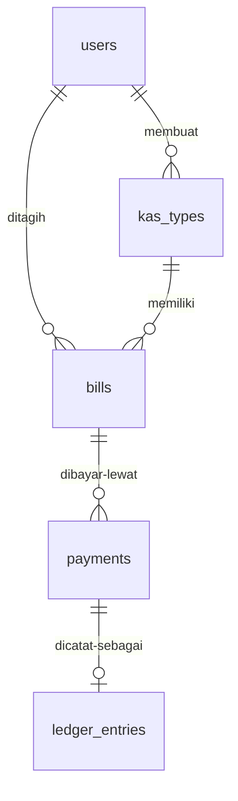
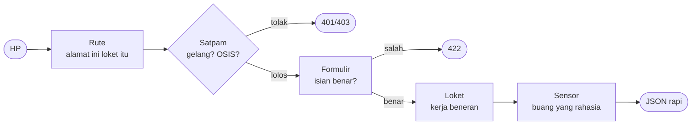
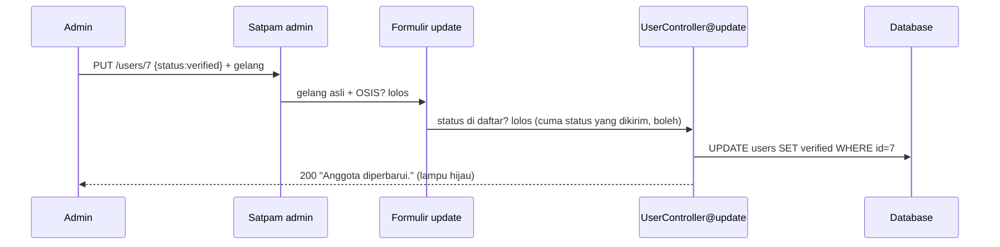
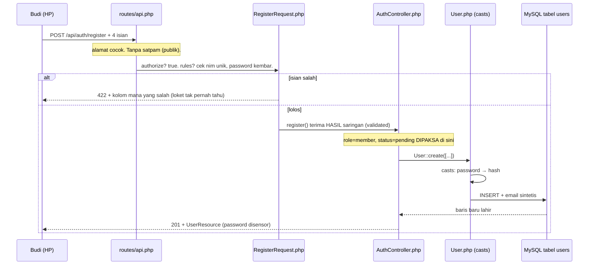
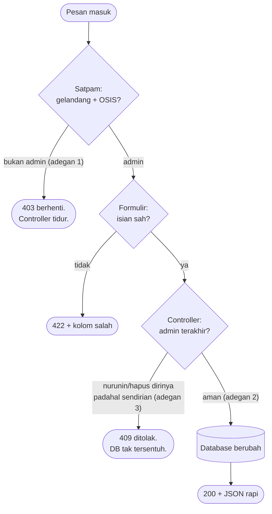

# Penjelasan Tahap 1 Smart-Kas — Edisi Naratif Langkah demi Langkah

> Ini rekaman perjalanan Rabu kemarin: apa yang diketik, file apa yang
> lahir, kodenya apa, dan kenapa begitu. Dibaca dari atas ke bawah =
> kamu mengulang persis yang aku lakukan, dari nol sampai 9 tes hijau.
>
> Bahasa sehari-hari, istilah resmi pemrograman dipakai apa adanya
> (**migration, model, middleware**...) biar telingamu terbiasa.
> Tiap istilah dijelaskan pakai analogi SMP di kemunculan pertamanya,
> setelah itu dipakai biasa kayak nama teman.
>
> 💬 = aku lagi cerita, bukan dokumentasi kaku.

---

## Bab 0. Peta Perjalanan

```
PAGI                    SIANG                    SORE                    MALAM
 │                       │                        │                        │
 ▼                       ▼                        ▼                        ▼
Cek alat + belanja   Gambar kerja 5 tabel    Kartu keluarga         Loket + formulir
Sanctum (Bab 1-2)    + bangun (Bab 3-7)      5 model (Bab 8)        + satpam (Bab 9-11)
                                                                              │
                                                              Isi contoh + tes +
                                                              bug (Bab 12-15)
```

Hasil akhir: anggota bisa daftar → admin menyetujui → semua bisa login
pakai **token** → 9 tes hijau. Fondasi doang. Rumahnya (bayar QRIS,
buku kas) baru dibangun besok.

---

## Bab 1. Pagi: Cek Dapur, Belanja Sanctum

💬 Sebelum masak, koki cek kompor. Aku buka terminal di folder proyek,
cek tiga hal: `php -v` (bahasa/kokinya, 8.5), `composer -V` (tukang
belanja paket, 2.10), `php artisan --version` (dapurnya, Laravel 13.35).
Terus intip isi: folder `routes/` belum punya `api.php`, `app/Models/`
cuma ada `User.php` bawaan, database `smartkas` (MySQL) sudah nyambung
dengan 3 tabel bawaan berstatus `Ran`. Dapur nyala. Gas.

Aplikasi kita itu **API**: HP ngobrol ke server pakai pesan JSON tanpa
browser. Jadi tiap pesan harus bawa bukti "saya sudah login". Buktinya
namanya **token** — teks acak panjang. Yang bikin dan ngecek token:
paket resmi Laravel bernama **Sanctum**. Analoginya **gelang konser**:
beli tiket (login) → dapat gelang (token) → tiap masuk area tunjukin
gelang → pulang digunting (logout).

Belanja + pasang, dua baris:

```bash
composer require laravel/sanctum
php artisan install:api
```

Yang pertama = "belanja Sanctum, catat di daftar belanja." Yang kedua =
"OB, pasang instalasi API!" — dan OB otomatis bikinin `routes/api.php`,
tabel lemari gelang (`personal_access_tokens`), plus ninggalin pesan:
"pasang tempelan `HasApiTokens` ke model User ya" (dikerjakan Bab 8).

Isi lemari gelang: `tokenable_type` + `tokenable_id` (pasangan ini
namanya **morphs** — kolom "pemilik" fleksibel: tulis nama tipe +
nomornya, jadi bisa milik user atau tipe lain), `name` (nama gelang,
misal `api`), `token` (isinya, disimpan versi acak/**hash**),
`abilities` (label kemampuan: `admin`/`member` — gelang emas vs biru),
`last_used_at` + `expires_at` (terakhir dipakai + kedaluwarsa kapan).

---

## Bab 2. Siang: Gambar Kerja (Migration) — Nambah Kolom Tanpa Merobek Halaman

💬 **Migration** = gambar kerja membangun tabel. Punya dua fungsi:
`up()` (maju: bangun) dan `down()` (mundur: bongkar kalau batal).
Perintah lahirnya selalu `php artisan make:...` — OB yang bikinin
filenya, aku yang nulis isinya. Tidak ada file lahir tanpa perintah.

Tabel `users` bawaan sudah ada (`name`, `email`, `password`), tapi PRD
minta tambahan `nim`, `role`, `status`, `discord_id`. Aturannya jangan
utak-atik bawaan. Jadi solusinya **migration alter**: nambah kolom di
buku absen tanpa merobek halaman lama.

```bash
php artisan make:migration alter_users_add_smartkas_fields --table=users
```

```php
Schema::table('users', function (Blueprint $table) {
    $table->string('nim', 30)->unique()->after('id');
    $table->string('role', 10)->default('member')->after('password');
    $table->string('status', 10)->default('pending')->after('role');
    $table->string('discord_id', 50)->nullable()->after('status');
});
// down(): dropColumn keempatnya. Tabel asli tetap utuh.
```

Cara bacanya: **Schema** itu mandor (`table` = kerjakan yang sudah ada,
`create` = bangun baru). **Blueprint** itu cetak birunya. Tiap baris =
satu kolom. `string('nim', 30)` = teks max 30 huruf. `unique()` = aturan
keras database: tidak boleh kembar (NIS satu nomor satu anak).
`default('member')` = jawaban yang sudah dicentang duluan. `nullable()` =
boleh kosong. `after(...)` = murni kerapian posisi.

Dua kolom ini nentuin nasib tiap akun: `role` cuma `member` (siswa biasa)
atau `admin` (ketua + bendahara, haknya SAMA). `status` itu lampu lalu
lintas pendaftar — `pending` kuning (nunggu), `verified` hijau (boleh
bayar + lihat dana), `rejected` merah (ditolak).

---

## Bab 3. Tiga Aturan Cerai (wajib hafal sebelum baca tabel lain)

Kolom **foreign key** = kolom yang isinya nomor pintu tetangga
(id dari tabel lain). `constrained('users')` = "tetangganya tabel users,
tolong dijagain." Nah, kalau tetangganya DIHAPUS, apa yang terjadi sama
baris kita? Ada tiga aturan, dan tiap tabel di bawah pakai salah satunya:

| Aturan | Kalau yang ditunjuk dihapus... | Analogi |
|---|---|---|
| `nullOnDelete()` | Kolom dikosongi, baris TETAP ADA | Guru pindah → soalnya tetap dipakai |
| `cascadeOnDelete()` | Baris IKUT DIHAPUS berantai | Siswa keluar → rapotnya ikut dibuang |
| tanpa aturan (restrict) | DILARANG hapus yang ditunjuk | Tidak boleh cabut tiang selagi atap nempel |

Dua aturan pendukung: `unique()` = tidak boleh kembar (plus otomatis
jadi jalan pintas pencarian). `index()` = daftar isi di belakang buku:
tidak mengubah data, cuma bikin pencarian cepat.

---

## Bab 4. Empat Tabel Baru (pola yang sama, beda isi)

Lahirnya satu pola: `php artisan make:model KasType -m -f` (model +
migration + factory sekaligus), sisanya `make:model Bill/Payment/
LedgerEntry -m`. Terus `php artisan migrate` → lima-limanya DONE.
Isi migrasinya:

```php
// kas_types — buku daftar iuran ("Kas Oktober 2026, 10 ribu, tempo 31 Okt")
Schema::create('kas_types', function (Blueprint $table) {
    $table->id();                                   // nomor urut = primary key
    $table->string('name');
    $table->text('description')->nullable();        // teks bebas, boleh kosong
    $table->unsignedBigInteger('amount');           // rupiah, bulat, TAK BOLEH MINUS
    $table->date('due_date');                       // tanggal aja (tanpa jam)
    $table->boolean('is_active')->default(true);    // saklar: dimatikan, bukan dihapus
    $table->foreignId('created_by')->nullable()->constrained('users')->nullOnDelete();
    $table->timestamps();                           // created_at + updated_at otomatis
});
```

Dua hal yang perlu direnungkan. Satu, `unsignedBigInteger`: `unsigned` =
minus ditolak database, dan rupiah SELALU bilangan bulat — uang koma
(float) bikin error pembulatan (10.000 bisa jadi 9.9999999). Dua,
`created_by` pakai `nullOnDelete`: admin pembuatnya dihapus → paketnya
tetap ada, kolom pembuat dikosongi. (Namanya `created_by`, bukan
`user_id` standar — ingat ini, soalnya di model nanti harus disebut
eksplisit.)

```php
// bills — buku tagihan per anak ("A wajib bayar paket X sekian")
Schema::create('bills', function (Blueprint $table) {
    $table->id();
    $table->foreignId('user_id')->constrained()->cascadeOnDelete();
    $table->foreignId('kas_type_id')->constrained()->cascadeOnDelete();
    $table->unsignedBigInteger('amount');           // SALINAN nominal saat dicetak
    $table->string('status', 10)->default('unpaid');// unpaid / paid / cancelled
    $table->timestamp('paid_at')->nullable();       // tanggal+jam lunas
    $table->unique(['user_id', 'kas_type_id']);     // satu anak satu paket = satu tagihan
    $table->timestamps();
});
```

`constrained()` tanpa sebut tabel = Laravel nebak sendiri (`user_id` →
tabel `users`). Aturannya cascade: anak keluar atau paket dihapus →
tagihannya ikut dibuang. `amount` di sini SALINAN, bukan link — kayak
nota belanja: harga di nota tidak berubah walau harga etalase naik
besok. Dan `unique` gabungan = tidak bisa ditagih dobel.

```php
// payments — buku PERCOBAAN bayar (bisa gagal, bisa coba lagi)
Schema::create('payments', function (Blueprint $table) {
    $table->id();
    $table->foreignId('bill_id')->constrained()->cascadeOnDelete();
    $table->string('order_id')->unique();           // nomor antrean ke gerbang bayar
    $table->string('channel', 10)->default('qris'); // qris / cash
    $table->unsignedBigInteger('amount');           // nominal paket
    $table->unsignedBigInteger('fee')->default(0);  // biaya jasa (0 kalau tunai)
    $table->unsignedBigInteger('total_amount');     // amount + fee = yang di-QRIS
    $table->string('status', 10)->default('pending');// pending/paid/failed/expired/cancelled
    $table->string('gateway_ref')->nullable();
    $table->text('qr_string')->nullable();          // kode QR-nya
    $table->timestamp('expires_at')->nullable();    // batas waktu bayar
    $table->json('gateway_payload')->nullable();   // data mentah gerbang (amplop bukti)
    $table->foreignId('recorded_by')->nullable()->constrained('users')->nullOnDelete();
    $table->text('note')->nullable();
    $table->timestamp('paid_at')->nullable();
    $table->timestamps();
    $table->index(['bill_id', 'status']);           // jalan pintas cari
});
```

Uangnya dipisah tiga (`amount` + `fee` = `total`) biar jelas: yang masuk
kas cuma nominal, fee lewat ke gerbang. Tagihan tetap `unpaid` selama
belum ada yang `paid` — gagal/kedaluwarsa ya coba lagi, bebas.

```php
// ledger_entries — buku kas bendahara beneran
Schema::create('ledger_entries', function (Blueprint $table) {
    $table->id();
    $table->string('type', 10);                     // income / expense
    $table->string('category', 30);                 // iuran, saldo_awal, pengeluaran...
    $table->unsignedBigInteger('amount');
    $table->text('description')->nullable();
    $table->date('entry_date');
    $table->foreignId('payment_id')->nullable()->unique()->constrained()->nullOnDelete();
    $table->foreignId('created_by')->constrained('users')->cascadeOnDelete();
    $table->softDeletes();                          // hapus halus (dicoret pensil)
    $table->timestamps();
    $table->index(['type', 'category']);
});
```

Saldo = total income − total expense, SELALU dihitung, tidak disimpan.
`payment_id` unik + boleh kosong: baris dari pembayaran nyambung ke
baris pembayarannya (satu banding satu — nota asli tidak boleh dicoret,
dijagain Tahap 2). `softDeletes` = hapus = isi tanggal di kolom
`deleted_at`, datanya masih ada kalau perlu dibaca lagi.

Peta hubungan kelimanya:



---

## Bab 5. Model: Kartu Keluarga Tiap Tabel

💬 Migration = gedungnya. **Model** = kartu keluarganya: "saya tabel apa,
berhubungan dengan siapa." Semua pertanyaan ke database ngomong lewat
model — cara ngomongnya namanya **Eloquent**.

Empat pola relasi, hafalkan sekali buat semua model:

| Pola | Bacanya | Contoh |
|---|---|---|
| `hasMany` | Saya induknya | User punya banyak Bill |
| `belongsTo` | Saya anaknya | Bill milik satu User |
| `belongsToMany` via tabel ketiga | Kami terhubung lewat buku perantara | User ↔ KasType lewat `bills` (+ `withPivot` = bawa kolom perantara, `withTimestamps` = ada stempel waktu) |
| `hasOne` | Saya induk satu anak | Payment punya satu LedgerEntry |

`app/Models/User.php` (dipadatkan, import standar disembunyikan):

```php
#[Fillable(['nim', 'name', 'email', 'password', 'role', 'status', 'discord_id'])]
#[Hidden(['password', 'remember_token'])]
class User extends Authenticatable          // blanko "bisa login", bukan kertas biasa
{
    use HasApiTokens, HasFactory, Notifiable;   // tempelan: cetak gelang + fotokopi + notifikasi

    protected function casts(): array
    {
        return ['email_verified_at' => 'datetime', 'password' => 'hashed'];
    }

    public function isAdmin(): bool    { return $this->role === 'admin'; }
    public function isVerified(): bool { return $this->status === 'verified' || $this->isAdmin(); }

    public function bills(): HasMany            { return $this->hasMany(Bill::class); }
    public function createdKasTypes(): HasMany  { return $this->hasMany(KasType::class, 'created_by'); }
    public function recordedPayments(): HasMany { return $this->hasMany(Payment::class, 'recorded_by'); }
    public function ledgerEntries(): HasMany    { return $this->hasMany(LedgerEntry::class, 'created_by'); }
    public function kasTypes(): BelongsToMany  {
        return $this->belongsToMany(KasType::class, 'bills', 'user_id', 'kas_type_id')
            ->withPivot(['amount', 'status', 'paid_at'])->withTimestamps();
    }
}
```

Tiga tameng di sini. `Fillable` = kolom yang boleh diisi lewat data luar
(yang tidak ada di daftar, dikirim 100x pun ditolak). `Hidden` = yang
disensor tiap data keluar (password tidak pernah ke browser).
`casts` = penerjemah otomatis: password masuk langsung **diacak satu arah
(hash)** — `password123` tersimpan jadi `$2y$12$...`, bisa dicek pakai
`Hash::check` tapi tidak bisa dibaca balik. Ibarat surat masuk mesin
penghancur pola: keasliannya bisa dicek, isinya tidak bisa dibaca.

Satu jebakan: `hasMany(KasType::class, 'created_by')` — argumen kedua
wajib karena kolomnya tidak bernama standar. Lupa nyebut → Eloquent
nyari `user_id` yang tidak ada → error. Migrasi dan model harus selalu
cocok nama.

Empat model lain polanya sama (sisi anak/cerminan):

- **KasType**: fillable nama s/d pembuat; `bills()` hasMany;
  `users()` belongsToMany cerminan; `creator()` belongsTo via
  `created_by`. `due_date` di-cast tanggal, `is_active` boolean.
- **Bill**: `user()` + `kasType()` belongsTo (nama standar, tanpa
  argumen); `payments()` hasMany; plus jurus **`scopeUnpaid`**
  (tombol preset mesin cuci: `Bill::unpaid()->get()` — dipakai
  pengingat Discord Tahap 2).
- **Payment**: `bill()` belongsTo; `ledgerEntry()` hasOne;
  `recorder()` belongsTo via `recorded_by`. `gateway_payload`
  di-cast `array` (kolom JSON langsung dipakai kayak array, tanpa
  `json_decode` manual).
- **LedgerEntry**: `use SoftDeletes` — habis ini semua query otomatis
  nyaring yang dicoret (kecuali diminta khusus). `payment()` +
  `creator()` belongsTo.

---

## Bab 6. Query Builder dari Nol (satu bab, unfolding pelan)

💬 **Query** = pertanyaan ke arsip. **Builder** = menyusunnya kata per
kata, dirantai pakai `->`. Aturan mainnya cuma satu: semua panah cuma
**menyusun daftar belanja** — database baru gerak pas perintah penutup
(**terminator**: `get`, `first`, `count`, `paginate`, `sum`, `create`,
`update`, `delete`).

Contohnya daftar anggota (`UserController@index`):

```php
$perPage = min((int) $request->query('per_page', 15), 100);

$users = User::query()
    ->when($request->query('status'), fn ($q, $v) => $q->where('status', $v))
    ->when($request->query('role'), fn ($q, $v) => $q->where('role', $v))
    ->when($request->query('q'), fn ($q, $v) => $q->where(
        fn ($qq) => $qq->where('name', 'like', "%{$v}%")->orWhere('nim', 'like', "%{$v}%")
    ))
    ->latest()
    ->paginate($perPage);
```

Bahasa wartegnya: "Bang... (`query`) — kantong isi berapa, default 15
max 100 biar dapur tidak meledak — kalau nyebut status, saring itu
(`when` = KETIKA ada, kerjakan; tidak ada, lewati — jadi tidak perlu
nulis `if` empat kali) — kalau nyebut kata kunci, cari yang namanya ATAU
nim-nya mengandung itu (`%budi%` = yang penting ada budinya) — yang
terbaru dulu (`latest`) — bungkus per kantong (`paginate`, SEKARANG
abang gerak)."

Kenapa `where` di dalam `where`? Itu **tanda kurung**. Tanpa kurung,
`orWhere` bocor: `status=pending AND name~budi OR nim~budi` bikin anak
lunas bernama Budi ikut muncul. Dengan kurung:
`status=pending AND (name~budi OR nim~budi)`. Sama kayak matematika:
kurung mengubah arti. (Catatan jujur: kalau yang dicari malah tanda `%`
sendiri, hasilnya ngaco — ketahuan pas review, antre Tahap 2.)

Jurus lain yang dipakai Tahap 1, sekali lewat: `where(...)->first()`
(ambil satu, tidak ada → null — dipakai login), `findOrFail`/binding
otomatis (tidak ada → 404), `create`/`update`/`delete`, `count()`
(hitung sisa admin buat tameng), `loadCount` (detail anggota: total,
belum, lunas — tiga angka sekali jalan), `updateOrCreate` (seeder:
ada ya update, tidak ada ya bikin — dijalankan 10x tetap 10 baris),
`is()` ("ini baris yang sama denganku?" — cegah hapus diri sendiri).

### Kamus sintaks: bedah baris tersulit, simbol per simbol

Ambil baris ini:

```php
->when($request->query('status'), fn ($q, $v) => $q->where('status', $v))
```

- `->` = "punya / lakukan". `A->b()` = suruh objek A kerja. Ini sintaks
  dasar PHP buat objek, bukan ciptaan Laravel.
- `::` = "milik kelas". `User::query()` = panggil fungsi `query` milik
  KELAS User tanpa bikin objek dulu. Bedanya sama `->`: `::` pakai nama
  kelas, `->` pakai objek yang sudah ada.
- `$request` = pesan yang datang. Bawaan: Laravel yang nitip, bukan kita
  yang bikin. `$request->query('status')` = "baca tulisan `?status=...`
  di alamat". Tidak ada → hasilnya `null` (kosong).
- `when(nilai, fungsi)` = "KETIKA nilainya ada, jalankan fungsi itu;
  kalau kosong, lewati." Fungsi `when` ini bawaan query builder.
- `fn ($q, $v) => ...` = **fungsi panah** (arrow function, sintaks dasar
  PHP — versi pendek dari `function`). `$q` = pertanyaannya (query yang
  lagi disusun — DITITIPKAN oleh `when`, bukan kita yang bikin).
  `$v` = nilainya (isi `?status=...` — DITITIPKAN juga). Nama `$q`/`$v`
  bebas diganti (`$query`/`$nilai` hasilnya sama) — yang penting
  POSISINYA: pertama selalu query, kedua selalu nilai.
- `=>` di sini = "hasilkan/kembalikan". `fn ($q, $v) => $q->where(...)`
  = "terima q dan v, kembalikan q yang sudah ditambah syarat". (Awas:
  `=>` di array seperti `['a' => 1]` artinya pasangan kunci-nilai.
  Panah sama, konteks beda.)
- `$q->where('status', $v)` = tambah syarat "kolom status = nilai v".
  Versi lengkapnya tiga argumen `where(kolom, operator, nilai)` —
  kalau operatornya `=` boleh disingkat dua argumen.
- `fn ($qq) => $qq->where(...)->orWhere(...)` (yang di pencarian `q`) =
  fungsi panah BERSARANG. `$qq` objek yang SAMA kayak `$q`, cuma namanya
  dibedain biar tidak bingung — Laravel yang nitip juga. Hasilnya = tanda
  kurung di SQL (Bab 6).
- `"%{$v}%"` = teks sisipan: `{$v}` diganti isinya (`budi` → `%budi%`).
  `%` di LIKE = "bebas apa aja". Syaratnya: kutip DUA (`"`) baru bisa
  sisip variabel; kutip SATU (`'`) tidak bisa.
- `(int)` = paksa jadi angka (`"50"` → `50`). `min(..., 100)` = ambil
  yang lebih kecil (rem di 100).
- `$this->route('user')` = "baca parameter `{user}` dari alamat". Isinya
  TERGANTUNG controller: kalau parameternya ditulis `User $user` (model)
  ya dapat MODEL utuh (jebakan Bab 11!); kalau ditulis `$id` polos ya
  dapat angka.

---

## Bab 7. Perjalanan Satu Permintaan (peta terpenting)

Setiap pesan HP ke server lewat 6 pos ini, SELALU urut:



Kode angkanya = lokasi gagalnya: 401 belum login, 403 tidak berhak,
404 tidak ada, 409 tabrakan aturan, 422 isian salah, 429 kebanyakan
gedor. 200 berhasil, 201 berhasil + ada yang lahir.

Adegan utama Tahap 1 — admin menyetujui pendaftar:



### Jejak 1: satu register, file per file sampai end

Skenario: Budi daftar. Pertanyaanmu: **apa saja yang wajib? Discord
wajib?** Jawaban tegas — buktinya dari aturan formulir:

| Kolom | Wajib? | Bukti |
|---|---|---|
| `nim` | YA | `required` + `unique` |
| `name` | YA | `required` |
| `password` + `password_confirmation` | YA (berpasangan, harus sama) | `required` + `confirmed` |
| `role` / `status` | TIDAK — malah dicuekin | tidak ada di rules RegisterRequest |
| `discord_id` | TIDAK — tidak dikenal di sini | tidak ada di rules; cuma ada di Store (admin) dan itu pun `nullable` = boleh kosong |
| `email` | TIDAK — sistem yang bikinin | controller isi `nim@smartkas.local` |

Jadi: pendaftar cuma butuh 4 isian. Discord tidak menyentuh hidupnya
sama sekali.

Jejaknya (nama file di tiap lompatan — hafalkan pola ini, semua endpoint
begitu):



Lima lompatan, tidak ada yang loncat antre: **Rute → Formulir →
Loket → Model → Database → pulang lewat Sensor.** Kalau gagal di formulir,
loket tidak pernah dipanggil — buktinya ada di diagram (panah 422 balik
langsung).

### Jejak 2: cuma ada 1 admin (tiga adegan, satu peta)

Setup: ADM001 satu-satunya admin di dunia. Tiga hal dicoba:

1. Anggota verified buka `GET /users` → mati di POS SATPAM
   (`EnsureAdmin`: bukan admin → 403). Controller tidak pernah dibangunkan.
   File tersentuh: `routes/api.php` → `EnsureAdmin.php`. Selesai.
2. ADM001 setujui pendaftar (`PUT /users/7 {status:verified}`) → lolos
   satpam → lolos formulir → controller update → database berubah → 200.
   File tersentuh: rute → satpam → `UpdateUserRequest.php` →
   `UserController.php` → `UserResource.php`.
3. ADM001 iseng turunkan dirinya (`PUT /users/1 {role:member}`) → lolos
   satpam, lolos formulir → DIHADANG controller: hitung admin = 1 →
   409, database TIDAK disentuh. Hapus diri sendiri dihadang lebih awal
   (`is()` check) → 409 juga.

Satu peta untuk ketiganya — ikuti panahnya sesuai adegan:



---

## Bab 8. Formulir, Satpam, Loket (bedah cepat, tanpa pengulangan)

**Empat formulir (FormRequest)** — `authorize()` semua `true` (yang jaga
pintu biar satpam, bukan formulir). Kamus aturannya: `required` wajib
ada, `sometimes` kalau dikirim periksa kalau tidak skip, `nullable`
boleh kosong, `string/max/min` batas teks, `in:` pilihannya cuma ini,
`confirmed` wajib ada kembaran yang sama (tanda tangan dua kali),
`unique:users,nim` database yang nolak kembaran.

| Formulir | Beda dari yang lain |
|---|---|
| Register | TANPA role/status — pendaftar tidak bisa nitip jadi admin; sistem paksa `member` + `pending` |
| Login | Cuma nim + password |
| Store (admin nambah manual) | Boleh isi role/status; default langsung `verified` |
| Update | Semua `sometimes` — verifikasi = kirim `{"status":"verified"}` doang; nim pakai `Rule::unique()->ignore` (ceritanya Bab 11) |

**Dua satpam (middleware)** — signature wajib
`handle($request, $next)`: `$next($request)` = "teruskan!".
`EnsureAdmin`: kartunya cap OSIS? Bukan → 403. Jaga seluruh `/users`
(ada tesnya: anggota biasa → 403). `EnsureVerified`: lampunya hijau?
(admin otomatis hijau). Statusnya: sudah dilatih + terdaftar di
`bootstrap/app.php` sebagai alias `verified`/`admin` (nomor cepat:
tulis `'admin'`, maksudnya kelas panjangnya), tapi belum ditempatkan —
pintu data dana baru dibangun Tahap 2. File bootstrap itu juga yang
mewajibkan semua error `/api/*` berupa JSON.

**Loket daftar+login (`AuthController`)**: register paksa
`member`/`pending` + email sintetis `nim@smartkas.local` + jawab 201.
Login: cari nim (`first`), cocokkan pakai `Hash::check` (bandingkan kunci
dengan gembok tanpa membukanya), user tidak ada langsung 401 TANPA
ngecek hash, pesan 401 SENGAJA umum biar tidak bisa nebak nim mana yang
terdaftar, cetak gelang (`createToken('api', abilities)` — teks aslinya
cuma ada sekali ini) + jawab 200. Logout = gunting gelang yang dipakai
ini (`currentAccessToken()->delete()`). `me` = kasih profil pemilik
gelang. Plus `throttle:10,1` di rute daftar+login: gedor >10x/menit
disuruh istirahat (anti nebak password pakai robot).

**Loket anggota (`UserController`)** — lima pintu dari satu baris
`apiResource` (`GET/POST /users`, `GET/PUT/DELETE /users/{user}`;
`{user}` + parameter `User $user` = binding otomatis, tidak ada → 404
sendiri). `index` sudah dibedah (Bab 6) + info kantong di `meta`.
`show` bawa rapor tagihan (masih 0 semua — tempatnya sudah siap).
`update` = verifikasi + tameng ganda: nurunin admin padahal dia
satu-satunya → 409; ganti nim → email sintetis ikut; jawab pakai data
terbaru (`fresh()`). `destroy` = hapus diri sendiri dilarang, hapus
admin terakhir dilarang, baru `delete()`. Analogi tamengnya: brankas
tidak boleh tanpa pemegang kunci.

**Sensor (`UserResource`)**: yang keluar cuma id, nim, nama, role,
status, discord_id, created_at. Password tidak pernah ikut. Dipakai
satuan maupun massal (`::collection`). Semua jawaban sukses satu amplop:
`{success, message, data, meta?}`.

---

## Bab 9. Penghuni Contoh (Seeder + Factory)

**Seeder** = sutradara (pemain sesuai skenario). **Factory** = mesin
fotokopi (figuran acak buat latihan). `php artisan db:seed` →
`DatabaseSeeder` bikin TEST001 + manggil `SmartKasSeeder`:

| NIM | Nama | Role | Status |
|---|---|---|---|
| ADM001 / ADM002 | Ketua / Bendahara | admin | verified |
| H1H024001–005 | Anggota 1–5 | member | verified |
| H1H024006–007 | Pendaftar 6–7 | member | pending |
| TEST001 | Test User | member | verified |

Password semua `password` (ditulis polos TIDAK APA karena casts model
otomatis mengacak). Dua pendaftar kuning sengaja disiapkan buat latihan
verifikasi: login ADM001 → hijaukan mereka → simulasi bendahara terima
anggota baru selesai.

Kenapa seeder aman dijalankan berkali-kali? `updateOrCreate([kunci],
[isi])`: ketemu ya update, tidak ya bikin — 10x jalan tetap 10 baris
(kemarin sempat gagal pakai `create` membabi-buta → dobel → error 1062;
pelajaran: tulis ulang itu murah, dobel data itu mahal).
`str_pad($i, 2, '0', ...)` = angka jadi 2 digit (`1` → `01`) biar NIM
rapi. Factory (`fake()->numerify('H1H024###')`, tiap `#` jadi angka
acak) dipakai di tes buat nyetak boneka.

---

## Bab 10. Gladi Bersih (9 Tes)

`php artisan test` → robot pura-pura jadi pengguna di database mainan
(SQLite di memori, diatur `phpunit.xml` — papan tulis yang dihapus tiap
selesai, MySQL asli tidak kotor; `RefreshDatabase` = bangun ulang tiap
simulasi). Hasil: **9/9 hijau.**

| # | Simulasi | Bukti |
|---|---|---|
| 1 | Daftar sambil nitip `role:admin` | Tetap member + pending |
| 2 | Login + profil | Token keluar + berlaku |
| 3 | Admin setujui pendaftar | Jadi verified |
| 4 | Anggota buka `/users` | 403 |
| 5 | Turunin + hapus admin terakhir | 409 × 2 |
| 6 | `inspire` + rute users ada | Bawaan utuh |
| 7 | Nim kembar | Ditolak `unique` |
| 8 | Password salah | 401 |
| 9 | Update kirim nim yang sama | 200 (regresi bug Bab 11) |

Metode kerjanya **TDD**: tes ditulis DULU → dilihat GAGAL (biar yakin
tesnya bisa nangkap bug — alarm yang tidak pernah dites bunyinya
mencurigakan) → kode diperbaiki seminimal mungkin → semua HIJAU.

---

## Bab 11. Cerita Bug: KTP Lama Ditolak Petugas

Versi asli barisnya:

```php
$id = $this->route('user');
'nim' => ['sometimes', 'string', 'max:30', 'unique:users,nim,'.$id],
```

Maksudku: "`$id` = angka dari `/api/users/7`, jadi abaikan baris 7."
Salah — karena **route model binding**: controller ditulis
`update(..., User $user)` (huruf besar = tipe model), maka Laravel
OTOMATIS menukar angka `7` jadi objek model lengkap SEBELUM formulir
dicek. `$this->route('user')` bukan `7`, melainkan segepok data. Terus
ditempel ke teks → model berubah jadi JSON (`{"id":2,"nim":...}`).
Aturannya jadi "abaikan yang id-nya = `{"id":2...`" — tidak ada yang
cocok, pengecualian mati. Admin kirim nim yang sama (tidak diubah)
→ "nim sudah dipakai!" → padahal dipakai dirinya sendiri. Kayak
perpanjang KTP bawa KTP lama, petugas bilang NIK sudah dipakai.

Lolos dari tes lama karena tesnya tidak pernah kirim nim (cuma status).
Bug tidur. Penangkapan: tulis tes regresi → GAGAL, error SQL-nya
menunjukkan potongan JSON nyasar di query (`... <> {"id":2 ...`) —
teori terbukti. Perbaikan satu baris:

```php
'nim' => [..., Rule::unique('users', 'nim')->ignore($this->route('user'))],
```

`Rule::unique()->ignore()` itu pintar: dikasih angka dipakai angkanya,
dikasih model diambil id-nya. Semua hijau. Pelajaran: jangan tempel
hasil `route()` ke teks mentah; bug yang tidak dites = bom waktu; error
SQL yang mengerikan = peta TKP paling jujur.

---

## Bab 12. Status + Antrean Tahap 2

Selesai: 5 tabel + 5 model + 4 formulir + 2 satpam + 2 loket + 1 sensor +
10 rute + 10 akun + 9 tes hijau. Semua dari command asli, bawaan utuh.

Antrean jujur dari review: error 422 diseragamkan ke amplop PRD · escape
`%`/`_` di pencarian · pasang satpam `verified` begitu pintu dananya ada ·
tegakkan `abilities` (atau hapus) · rapikan duplikasi kecil (tameng +
email sintetis di 5 titik → helper).

Besok: paket kas, tagihan otomatis, QRIS + webhook, buku kas terisi
sendiri, Discord. Fondasi dicor. Tinggal bangun rumahnya. 🏠

---

*Kalau ada baris yang masih buram, buka filenya, baca bareng babnya,
tanya. Tidak ada pertanyaan bodoh — yang ada cuma bug yang belum
ketemu tesnya.*
